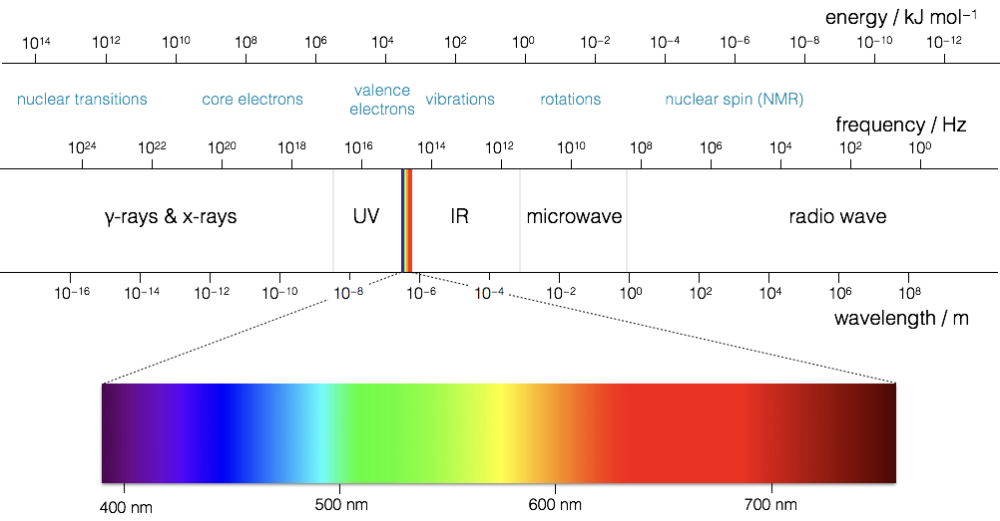

# Introduction to Photochemistry & Photophysics {#ch:Intro}

Some context on this course.

Photochemistry is by definition from IUPAC ‘the branch of chemistry concerned with the chemical effects of light’^[IUPAC Goldbook, http://goldbook.iupac.org/terms/view/P04588 (accessed July 2020).]. However, in this course we are going to explore beyond just chemical reactions to also examine some of the fundamental photo physics of systems. Photophysics is closely related to what you have previously studied in your first and second years, in that it is a study of the processes of absorption and emission of light and the kinetics of these processes.

Light is the very reason why there is life on earth, the outstanding beauty of processes such as photosynthesis or vision speak to the power of this branch of chemistry. Photochemistry offers a way for us to ‘cheat’ traditional chemical reactions, in that we no longer need thermal energy to get over an activation barrier, instead we use the energy of a photon. It is only by understanding how we can best utilise the bounteous resource of the sun’s light that we as a species can hope to to have a long and fruitful future on this planet.

It is just over 100 years since quantum theory revolutionised our understanding of matter and light, not quite 125 years since the discovery of the electron, but in that time we have achieved wonderful things, things that have revolutionised the way we live. From lasers in cd and blue ray players to their use in scanning bar codes, glow sticks - fun at festivals, essential in emergencies, or more prosaic uses such as sun creams, self cleaning windows or display technology. In this course you will learn about a range of photochemical and photophysical processes that underpin our modern lives and also learn about some of the current challenges and interest in the field.

**Spectroscopy**

* techniques

**Photochemistry**

* reactions
* molecular structure

**Photophysics**

* kinetics
* thermodynamics
* quantum mechanics


*Photophysical processes*

transitions which convert between excited states or between an excited state and a ground state of a molecule

*Photochemical processes*

reactions or rearrangements which occur as a consequence of excitation from the ground state

## Assumed background knowledge

The course relies heavily on first and second year kinetics concepts as well as building on the quantum mechanics from second year and some of the spectroscopy you did in first year. Whilst I have done my best to ensure that there is a minimum of non-physical chemistry content required to get the most out of this course if I want to talk about molecules some very basic knowledge from both organic and inorganic chemistry, much of which will at least have been mentioned at 'A'-level or IB.

I will talk a lot about σ and π bonding, but this has been covered in quantum mechanics, a double bond has one σ and one π bond. I will also talk about shape and structure, a carbon with only σ bonds is 3 dimensional and tetrahedral, a carbon with 3 σ and 1 π bond is trigonal planar, and one with 2 σ and 2 π bonds is linear. 

However we need to think about the fact that a molecular orbital exists over a hole molecule. If we reduce bond order overall we change the shape of the molecule. This will be discussed in the absorption (Chapter \@ref(ch:Abs)) section of this course.

If you need more help on structure, bonding or metal complexes Chemistry3 is an excellent book to start with, or please ask for help.

I also recommend:

* Principles & Applications of Photochemistry, Brian Wardle,Wiley, ISBN 0470014938 (available as an ebook from the library).
* Photochemistry, Carol E.Wayne & Richard P.Wayne, OUP (primer), ISBN 0198558864 (a really nice primer well worth the money if you are interested in photochemistry)
* Principles of Molecular Photochemistry, Nicholas J.Turro,V. Ramamurthy, J.C. Scaiano, University Science Books, ISBN 1891389573
* The book Principles of Fluorescence Spectroscopy (3rd Edition) by Joseph R. Lakowicz (Springer, ISBN 0387312781) may also be useful for the sections on fluorescence.


```{r , echo=FALSE, EMWave, out.width='60%', fig.show='hold', fig.cap='The orthogonal electric and magnetic oscillating fields of plan polarised light, propagating along the x-axis. From: [And1mu](https://upload.wikimedia.org/wikipedia/commons/9/99/EM-Wave.gif) / [CC BY-SA](https://creativecommons.org/licenses/by-sa/4.0)'}
knitr::include_graphics("images/EM-Wave.gif")
```


## Light {#sec:Light}


As you’ve already learnt light exhibits properties that have both a wave like and a particle like nature, and light was one of the fundamental pieces that lead towards the quantum theory of the atom. Newton had shown that light from the sun is comprised of a spectrum of colours, we now know that that spectrum goes beyond what we can see with our eyes.

```{r echo=FALSE, EMspect, out.width='100%', fig.show='hold', fig.cap='TheThe electromagnetic spectrum of light, frequency and energy are equivalent, so high frequency waves have high energy photons'}

```

In your studies you have already seen how large amounts of the electromagnetic spectrum is used for different spectroscopic techniques, making use of the quantised transitions within molecules. For example, infra-red light has the same energy as the vibrational transitions within molecules. In photochemistry, we are specifically interested in the visible and near UV part of the EM spectra as photons with this energy promote transitions for the valance electrons in the molecules we are interested in.

It is important never to forget the wave particle duality of light, however for much of photochemistry and photophysics it is perhaps simpler to consider the light as a stream of incident photons.

