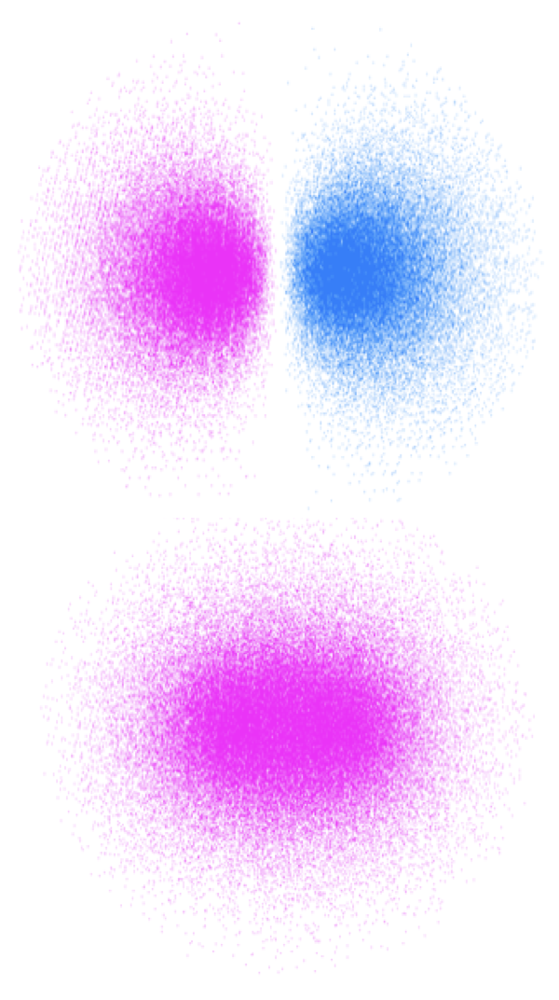

# Absorption of light {#ch:Abs}


### Learning Objectives {#sec:AbsLOs}


At the end of this section you should be able to:


* Appreciate changes in molecular geometry brought about by light absorption 
* Use the Beer Lambert Law to calculate light absorption
* Discuss electronic transitions in terms of Morse energy curves
* Explain the Franck Condon principle and Franck Condon factors
* List selection rules for excitation of a photon and describe factors which affect the molar extinction coefficient

There is a Concept Bite video in Section \@ref(sec:before1) which summarises much of this content.


## Introduction {#sec:AbsIntro}
As you have previously learnt energy levels are quantised, in other words atoms and molecules can only have defined amounts of energy. Different transitions (electronic, vibrational, rotational) in atoms and molecules use different characteristic portions of the electromagnetic spectra, Figure \@ref(fig:EMspect). 

When you saw atomic absorption and emission spectra the lines were very sharp, or in other words the absorption bands are very narrow as shown for the hydrogen absorption and emission spectra (figure \@ref(fig:HAbsEm)).This isn’t the case with molecular absorption spectra, particularly those in solution where absorption bands are typically hundreds of nanometers broad a typical organic fluorophor is shown in figure \@ref(fig:RhoAbsEm).The broad nature of the bands in molecular systems is a product of many individual factors including solvation, vibrational & rotational factors and non minimised structural configurations.


```{r echo=FALSE, HAbsEm, out.width='70%', fig.show='hold', fig.align='center', fig.cap='The absorption (top) and emission (bottom) spectra of hydrogen showing the very narrow band features, [image](http://montessorimuddle.org/2012/02/01/emission-spectra-how-atoms-emit-and-absorb-light/) adapted from [Adrignola](https://commons.wikimedia.org/wiki/User:Adrignola) licensed under CC BY 2.0'}
knitr::include_graphics("images/HAbsEm.png")
```

```{r echo=FALSE, RhoAbsEm, out.width='60%', fig.show='hold', fig.align='center', fig.cap='The absorption (black) and emission (teal) spectra of Rhodamine 6G in ethanol. The emission spectra was recorded with an excitation wavelength of 480 nm and a bandwidth of 4.25 nm^[Adapted from [OMLC](https://omlc.org/spectra/PhotochemCAD/html/083.html), [2nd July 2014]]'}

```

## Beer-Lambert Law {#sec:BeerLambert}

The empirical equation (equation \@ref(eq:BeerLambert), figure \@ref(fig:BeerLambert)) implies that the probability of a photon being absorbed at any point is the same (much like first order kinetics), and the amount of the total absorption depends upon the the concentration of the sample, c, and the ‘path length’, l. 

The amount of absorbance, A, is dependent upon the wavelength of the incident light, and the constant of proportionality, $\varepsilon$ (here called the molar extinction coefficient), is consequently also wavelength dependent.
\begin{equation}
\log \frac{I_0}{I}=A=\varepsilon cl
(\#eq:BeerLambert)
\end{equation}

The wavelength of a particular value of the molar exctinction coefficient is often represted as a subscript, $\varepsilon _\lambda$

```{r echo=FALSE, BeerLambert, out.width='50%', fig.show='hold', fig.align='center', fig.cap='The decay of intensity of monochromatic incident light through a uniformly absorbing medium. The decay follows an exponential pattern as elucidated in the Beer-Lambert equation.'}
knitr::include_graphics("images/BeerLambert.png")
```

The Beer-Lambert law makes a number of assumptions, and this exponential decay of the intensity of light is an important factor.When using the Beer-Lambert law you consider the intensity of the incident radiation, there is an assumption that the intensity of the radiation reaching each part of the sample does not deviate much from this. Hence high absorbing samples tend to show strong deviation from the Beer-Lambert’s linear relationship.

The Beer-Lambert law also has to make a number of other ‘reasonable’ considerations: 

- The solutions is well mixed, and absorbers are homogeneously distributed in solution.
- The absorbers do not scatter radiation (all particles will Rayleigh and Raman scatter but this is normally considerably less intense than absorption). Consequently solutions should be optically transparent as optically opaque solutions (such as colloidal solutions) have considerably stronger scattering. 
- The absorbers acts independently of each other, this means solutions need to be at a reasonably low concentration (typically less than 0.01 M, or maybe even less depending on the species) so as to avoid electrostatic or $\pi$ stacking interactions between the chromophores.This is in part important because light is only absorbed when the polarisation of the light is aligned with the transition dipole moment. 
- The incident radiation is collimated, and each photon should pass through the same path length. 
- The sample holder (cuvette) is optically ‘pure’ such that reflections are avoided (linked to the assumption above). 
- The incident radiation is monochromatic, or at the very least has a band width more narrow than the band width of the absorbing transition (this is usually not an issue for molecular systems as bandwidths are usually 10s or more of nm wide, but for atomic or ion spectroscopy where bandwidths are <0.02 nm this is a factor which must be carefully considered. 
- The incident radiation does not noticeably affect the concentration of the ground state, in other words the amount of excited states generated must be kept small as when we are talking about the absorption of a chromophore the concentration of that chromophore that appears in the Beer-Lambert equation is the ground state concentration. 
- There is no measurable emission from the sample. 

However, this empirical relationship can be examined in a deeper way.

## Molecular orbitals, HOMO & LUMO {#sec:MOs}

Ultimately, the absorption (and emission of a photon) which can be modelled empirically, as in the Beer-Lambert lawn, is actually a property of the quantum mechanics of the system as indicated by the models of absorption and emission of photons by Einstein.

If we think about the size of an atom or molecule (atoms are 100s of pm, molecules frequently less than 1 nm) they are considerably smaller than the wavelength of light required for electronic transitions, so it is often easier to think of an entirely photonic model of light. 

If we considered the atom or molecules to be formed of a cloud of electrons bathed in the electromagnetic field, the electron density is attracted to the the positive side of the field, and the positively charged nucleus to the negative side. However, electrons are much lighter (about 1/1760 the mass of a a proton) and so it is the lighter electrons that ‘feel’ the most effect. As the electric field oscillates it pushes and pulls the electrons within the molecule.

This transition is called an electric-dipole transition since it either creates (absorption) or destroys (emission) an oscillating electric dipole in the atom or molecule.The transition dipole moment, $\mu_i$, arises from the charge displacement during the transition. The magnitude of this transition dipole moment depends upon the distance the net electronic charge is moved from the ground state average position. This transition dipole is entirely independent of any permanent dipole moment within the molecule.

Figure \@ref(fig:Butadiene) shows the valence molecular orbitals of butadiene, showing the discrete energy levels in the system, absorption of a photon allows an electron to be excited from the highest occupied molecular orbital (HOMO) to any excited state.

Upon excitation of an electron there is a mixing of the molecular orbitals of the fully and partially occupied molecular orbitals, in the case of butadiene excitation of an electron from the HOMO to the LUMO (lowest unoccupied molecular orbital), giving the central C-C bond some double bond character, limiting rotation and leading to a structural change of the excited state.

```{r echo=FALSE, Butadiene, out.width='70%', fig.show='hold', fig.align='center', fig.cap='MO diagram of butadiene, each carbon atom is assumed to be sp^2^ hybridised, with linear combination of the 2p~z~ orbitals. As the energy of the levels increases so does the number of nodes. The lowest two energy levels are fully occupied in the ground state, upon absorption of a photon an electron is promoted to one of the anti-bonding orbitals allowing rotation around the double bonds, and giving the centre single bond some double bond character.^[[MO diagram of butadiene](https://2012books.lardbucket.org/books/principles-of-general-chemistry-v1.0m/s13-04-polyatomic-systems-with-multip.html). From by Averill & Eldredge, Principles of General Chemistry licensed under CC BY 2.0. Sept 14.]'}

```

In simple organic molecules we only really need to consider $\pi$ and $\pi^\ast$ and $n$ (non-bonding) molecular orbitals as the energy difference between $\sigma$ and $\sigma^\ast$ orbitals are comparatively very large. 

The process of absorption of a photon is very fast (~1 fs) (compared with the timescales of vibrations in molecule (~10 ps)), this is the basis of the Franck-Condon principle. Consequently when absorption (and emission) processes are sketched, as in figure \@ref(fig:FrankCondon), absorption and emission can be indicated by vertical transitions.

The ‘strength’ of the absorption transition, which relates to the extinction coefficient in the Beer-Lambert law, and the Einstein $B$ coefficient is in fact a measure of the ‘overlap integral’ of the wave functions of the ground and excited states. 
It becomes more obvious why the Einstein $B$ and $B’$ factors are only the same in atomic systems, since in the usual ‘lifetime’ of the excited state of molecular systems there is plenty of opportunity for the molecule to undergo structural rearrangement or loose energy if excited into one of the vibrationally excited bands.

```{r echo=FALSE, FrankCondon, out.width='60%', fig.show='hold', fig.align='center', fig.cap='The vertical line of the absorption transition as the electron is promoted from the ground state to the excited state. The probability of the electron being excited into each vibrational level is given by the ‘overlap’ of the wave functions of ground and each excited state.^[[Franck-Condon Diagram](https://commons.wikimedia.org/wiki/File:Franck-Condon-diagram.png). From Wikimedia Commons, created by [Mark M. Somoza](http://www.gnu.org/licenses/fdl-1.3.html), CC-BY-SA-[3.0](https://creativecommons.org/licenses/by-sa/3.0/). Sept 14. ]'}

```

The greater the overlap integral between the ground and excited state the higher the molar extinction coefficient and the more strongly coloured the molecule. 

Understanding the variation of possible electronic transitions available when electronic levels are mixed with vibrational and rotational levels, as well as the molecular dynamics allowing multiple ‘non-minimised’ structures explains the relative broadness of molecular electronic absorption and emission spectra.


```{r echo=FALSE, Anthracene, out.width='90%', fig.show='hold', fig.align='center', fig.cap='The absorption spectra of anthracene in cyclohexane showing the vibrational fine structure, combined with a sketch of the potential energy wells of the ground and excited states. Regions with the highest molar extinction coefficient have the largest overlap integrals of the wavefunctions of the ground and excited states. '}
knitr::include_graphics("images/Anthracene.png")
```

## Multiplicity {#sec:multiplicity}

If you recall Hunds’ rule when filling atomic and molecular orbitals you will recall that the lowest energy state occurs when the spin of the electrons is aligned. Usually in an organic molecular orbital the HOMO is a fully occupied $\pi$ set, or a fully occupied set of non bonding orbitals with all electrons paired. 

It is common to refer to the electronic states in a molecule by their *spin multiplicity*,  given by $2S+1$, where $S$ is the sum of the electronic spins of the electrons in the orbital. For a species in which all of the electrons are paired $S = 0$, and so $2S+1 = 1$ and the state is referred to as a *singlet*.

If two electrons are unpaired they will (in the lowest energy configuration) have parallel spins, the total spin $S = 1$ and so the spin multiplicity, $2S + 1 = 3$. This state is referred to as a *triplet* state.

Species such as free radicals have one unpaired electron, consequently $S = ½$, and $2S + 1 = 2$, and the species is referred to as a *doublet*.

Triplet states with the same electronic configuration (other than spin) have a lower energy than corresponding singlet states due to an effect called spin correlation. In triplet states the motion of the electrons in the orbitals are organised in such a way as to minimise the coulombic interactions between the charges, by minimising these coulombic interactions the energy of the system is also lowered.

Although formally flipping of electron spin is forbidden in photophysical and non photophysical processes it does occur. Processes that involve a change in electron spin are explained in later sections.

## Conjugation and the HOMO, LUMO energy gap, $\Delta E$ {#sec:conjugationandenergygap}

```{r echo=FALSE, EnergyLevels, out.width='20%', fig.show='hold', fig.align='center', fig.cap='The relative energy arrangement of orbitals in a molecule, this simple sketch is usually good enough to gain an understanding of the system under investigation.'}
knitr::include_graphics("images/nPiSigmaenergylevels.png")
```

The greater the amount of conjugation in a molecule the smaller the energy gap between the HOMO & LUMO and the longer the wavelength of photon absorbed.

This fits with the theory you learnt in your quantum mechanics lectures, where you can model the linear conjugated model quite accurately using the particle in a one dimensional box model.

Table: (\#tab:lambdaconj)  The dependence of maximum absorption wavelength on the increasing length of conjugation is clearly shown by moving along the diene, diene, polyene series. Inclusion of a hetero atom with lone pairs introduces non-bonding, $n$, electrons into the MO, and a second absorption band $n \longrightarrow \pi^\ast$ introduced with a lower energy transition.

|  | $\lambda$~max~ / nm <br>$\pi \longrightarrow \pi^\ast$    |  | $\lambda$~max~ / nm <br> $\pi \longrightarrow \pi^\ast$  <br> $n \longrightarrow \pi^\ast$|
|:----------|:----------|:----------|:----------|
| | 217 | | 270 <br>  187|
| | 227 | ||
| | 263 | | 324 <br> 219|
|  | 353 |  | |


## Selection rules for absorption & emission processes {#sec:selectionrules}

In molecular systems he most important selection rule is $\Delta S = 0$, or there can be no change in the spin multiplicity during an absorption or emission processes, or there can be no ‘flipping’ of electrons spin during a transition. In practice ‘coupling’ due to interactions between the spin of the electron and the orbital mean that this selection rule is not rigidly followed.

In organic molecules containing only C, H, N & O the direct absorption from S~0~ to T~1~ is so weak that it can’t be seen in the absorption spectra. This ‘spin-orbit coupling’ is more pronounced for heavier elements and molecules containing particularly heavy atoms, such as S, Cl or Br have more relaxed adherence to the $\Delta S = 0$ selection rule.

The Laporte selection rule is more relevant when looking at inorganic transition metal complexes, or for atomic spectra which will not be considered in this work. The Laporte states that there must be a change in angular momentum quantum number, $l$, upon absorption or emission in a cento symmetric system, or $\Delta l =  \pm 1$. So in a centro symmetric molecule, such as [Ti(H~2~O)~6~]^3+^, figure \@ref(fig:Tisplitting), the allowed transitions would be transitions such as the following:

\begin{equation*}
1s \longrightarrow 2p \hspace{2cm}\textrm{or} \hspace{2cm} 1s \longrightarrow 3p
\end{equation*}

Whilst these transitions would be forbidden according to the Laporte rule:

\begin{equation*}
1s \longrightarrow 2s \hspace{2cm}\textrm{or} \hspace{2cm} 1s \longrightarrow 3d
\end{equation*}

Consequently the $d-d$ transitions, such as the $t_{2g} \longleftrightarrow e_g$ transition in octahedral complexes, which give most transition metal complexes are forbidden according to the Laporte rule. 


```{r echo=FALSE, Tisplitting, out.width='60%', fig.show='hold', fig.align='center', fig.cap='The ligand field splitting of the 3d orbitals in a  [Ti(H~2~O)~6~]^3+^ complex the solution is pale purple with a molar extinction coefficient, ε ~ 6.1 M^−1^ cm^−1^'}

```

If we compare the magnitude of of the molar extinction coefficient for a typical $d-d$ absorption of a transition metal complex with that of a ‘spin allowed’ ‘Laporte allowed’ organic dye molecule we can see the effect of ‘non allowed’ transitions. In table \@ref(tab:extcoeff), the organics, DNA & the synthetic dye TOTO-1 both have extended conjugated molecular orbitals, and the transitions are from singlet to singlet, an allowed transition. 

In these cases the Laporte rule does not apply as there is no centre of symmetry. The two examples of transition metal complexes [Cu(H~2~O)~6~]^2+^ & [Ti(H~2~O)~6~]^3+^, have significantly lower molar extinction coefficients.

Molar extinction coefficients, if you recall, were a representation of the orbital overlap between the HOMO & LUMO, or a measure of how ‘allowed’ the transition is. The transitions which are Laporte forbidden are at least two orders of magnitude less intense than the allowed transitions of the organic molecules. 

Interestingly, permanganate which is relatively highly coloured when compared to other transition metal complexes cannot have colour due to $d-d$ transitions as the +7 oxidation state of the manganese ion leaves no electrons in either the $s$ or $d$ orbitals. Instead the colour is due to a charge transfer transition, where upon absorption of a photon an electron is briefly transferred from one of the oxygen ligands to the manganese metal centre. Ligand to metal charge transfer complexes (and the associated metal to ligand charge transfer complexes), are not subject to selection rules and so are relatively intense.

Table: (\#tab:extcoeff) The molar extinction coefficients of a range of molecules, the magnitude is strongly dependent upon the adherence to selection rules, the two organic molecules, DNA bases & TOTO-1 are both ‘spin allowed’, permanganate is a LMCT which has no selection rules, whereas the final three molecules all fall foul of the Laporte selection rule which states $\Delta l =  \pm 1$. Since these transitions are ‘forbidden’ the molar extinction coefficient is considerably lower than the allowed transitions.

|  | $\lambda$~max~ / nm | $\varepsilon _{\lambda}$ / M^-1^ cm^-1^ |
|:----------|:-----------|:-----------|
| DNA (per base) | 260 | 6600|
| TOTO-1 | 514 | 117000|
| KMnO~4~ | 520 | 1800 |
| CuSO~4~ | 810 | 20 |
| [Ti(H~2~O)~6~]^3+^ | 500 | 6.1 |
| PrCl~3~ | 445 | 0.07 |

The weak absorption carries on for the lanthanide complexes where $f-f$ transitions are again forbidden by the Laporte selection rule. However, Ce^3+^ and Tb^3+^ have more intense electronic absorption bands which appear in the UV. 

These are due to [Xe]4$f$^n^  to [Xe]4$f$^n-1^5$d$^1^ transitions. Since the electron is moving from an $f$ orbital to an $d$ orbital it is not forbidden by the Laporte selection rule and so is considerably more intense than the forbidden $f-f$ transitions. These transitions occur for these to ions due tooth stability provided by either an empty of half filled subshell.

## Structure and Bonding Upon Absorption of a Photon {#sec:structureonabs}

```{r echo=FALSE, Hbondingen, out.width='60%', fig.show='hold', fig.align='center', fig.cap='The energies of  bonding and anti bonding orbitals of molecular hydrogen, as an electron is prompted to the anti bonding σ* orbital the bond order is reduced to zero and the molecule ‘falls apart’..'}
knitr::include_graphics("images/Hbondingen.png")
```


```{r echo=FALSE, Hbondingorb, out.width='30%', fig.show='hold', fig.align='center', fig.cap='The bonding and anti bonding orbitals of molecular hydrogen showing the node along the σ bond for the anti-bonding orbital.'}

```

Upon absorption of a photon, if an electron is promoted to an anti bonding orbital there is a reduction in the bond order. For a hydrogen molecule, with just two electrons, this leads to radical formation figures \@ref(fig:Hbondingen) & \@ref(fig:Hbondingorb).
It should be remembered that there is still an electron in the bonding orbital and the molecular orbital is now a blend of the HOMO and LUMO. The LUMO 
For molecules with $\pi$ electrons excitation of an electron to a $\pi ^\ast$ orbital reduces the bond order to just 1, allowing for rotation around the previously restricted bond. If ethene is excited, the sp^2^ hybridised carbon, takes upon character of sp^3^ allowing rotation around the C-C bond, and changing the H-C-H bond angles. Rotation around a double bond is the basis of many photochemical reactions and is fundamental to vision where retinol, a long conjugated molecule undergoes a cis-trans isomerisation after excitation.

## The Transition Dipole Moment {#sec:transdipole}
One thing which hasn’t yet been considered is how light physically interacts with a molecule.

Classically it could be considered that the oscillating electric field of a wave could interact with a molecule if there was some resonance of the of the frequency of light and the frequency of oscillation  of the electron in an orbital, it would seem obvious that an electron (carrying an electric charge) and an electromagnetic wave (with its oscillating electric field) should interact; and will interact given the correct wavelength. In simple terms the frequency of light and the energy gap for the transition were the same. 

The classical model also explains why it is electrons which are excited (and not protons in the nucleus) because the considerably lighter electrons are more affected (and moved more) in the presence of the electric field.

This approach whilst covering the very basics of a transition does not particularly explain concepts such as the molar extinction coefficient, nor does it particularly consider concepts fundamental to quantum mechanics - such as quantisation of energy - an oscillating electric field is in no way quantised and there is no reason why excitation of the molecule should be quantised either.

However this idea of an oscillating dipole has some relation to quantum mechanics; because the shape of the molecular orbitals of the HOMO and LUMO are different and there will be a change in the electron distribution and hence a change in dipole of the molecule upon excitation. As such we can define a transition dipole moment for each chromophore - the more similar the ground and excited states the larger the transition dipole moment for the molecule.

A mathematical derivation of the transition dipole moment is beyond the scope of this work^[see Principles of Photochemistry by Turro *et al* if you wish to know more], but it is worth discussing as transition dipoles are hugely important when it come to energy transfer in molecules (see Förster Resonance energy transfer, Section \@ref({sec:forster}).

If we consider light as a wave polarisation is well understood, however there is a quantum mechanical explanation for polarisation as well - in short we can use wave behaviour to consider polarisation and photon behaviour to explain quantisation - just to stick with concepts which should be familiar to us.

Light is only absorbed by a molecule if the polarisation of the light aligns with the transition dipole moment on the molecule.  Figure \@ref(fig:CS2) shows CS~2~ a simple linear molecule - where the transition dipole moment runs along the long axis of the molecule.

```{r echo=FALSE, CS2, out.width='60%', fig.show='hold', fig.align='center', fig.cap='Carbon disulfide (CS~2~) is a linear molecule -  due to the shape of the molecule there is a transition dipole which runs down the length of the long axis. Light aligned such that the electric field runs parallel with the long axis of the molecule E~||~ will be absorbed, light which in which the electric field runs perpendicular to the long axis of the molecule E~⊥~ will not be absorbed.'}
knitr::include_graphics("images/CS2.png")
```

For more complicated molecules each of the transitions from the HOMO, HOMO-1 to the LUMO *etc.* occur with different transition dipole moments across the chromophore, figure \@ref{fig:adenosine}. Each transition is only excited when light is aligned with that transition; in most cases this isn’t something we need to consider as most incident light we consider is isotropic, but alignment of transition dipoles  (either between light and molecules - or between two different molecules) is an important consideration.

```{r echo=FALSE, adenosine, out.width='100%', fig.show='hold', fig.align='center', fig.cap='The three lowest energy transitions of adenosine each indicated with their transition dipole moment (all in the plane of the molecule, calculated values).These match with the observed spectrum with a weak transition around 310 nm, a much stronger transition around 260 nm and a third transition starting at the edge of the measured spectrum.^[Spectrum [Adapted from OMLC]( https:// omlc.org/spectra/PhotochemCAD/html/033.html), 31st October 2018]'}
knitr::include_graphics("images/adenosine.png")
```

As already discussed the transition dipole moment is derived from the difference in electron density of the ground and excited state. Figure \@ref(fig:PhenRubpy3) shows the HOMO and LUMO of an organic chromophore, and a metal complex MLCT state.

```{r echo=FALSE, PhenRubpy3, out.width='100%', fig.show='hold', fig.align='center', fig.cap='The calculated HOMO (bottom) and LUMO (top) of 1,10-phenanthroline (left) a model planar organic chromophore and [Ru (bpy)~3~]^2+^ (bpy - bipyridine) which has an MLCT state. For the ruthenium complex the HOMO is clearly centred on $4d_{z^2}$ orbital, whereas after absorption of a photon (and transfer of the electron) the electron density is then centred over the ligands in the LUMO.'}

```

## Factors Which Affect the Absorption

In the condensed phase the solvent is an important factor in determining the wavelength of maximum absorption, this effect, called solvatochromism, can be due to many properties of the solvent but is most likely due to solvent polarity. The LUMO energy level is unchanged in the different solvents, but the HOMO can either be more stabilised or less stabilised by the change in solvent (Figure \@ref(fig:solvato)).

```{r echo=FALSE, solvato, out.width='100%', fig.show='hold', fig.align='center', fig.cap='The change in absorption wavelength as the HOMO is destabilised in a solvent series, here is worth noting that the colour observed and the wavelength of maximum absorption are not the same thing. As the HOMO is destabilised there is a red shift in the wavelength required to excite the electron.'}

```

This leads to a change in the HOMO LUMO energy gap and consequently a change in the wavelength of maximum absorption. 

If the absorption maxima shifts to increasing wavelength (red shift, decreasing energy of transition) it is referred to as a bathochromic shift, whereas if the absorption maxima shifts to decreasing wavelength (blue shift, increasing energy of transition) it is referred to as a hypsochromic shift.

Another major factor that can affect the absorption of a sample are interactions between the chromophores. This is most commonly encountered with DNA, which shows a significantly higher absorption at high temperatures (Figure \@ref(fig:DNAmelt)). This is because the bases of DNA ‘stack’ to form the rungs of a ladder, this stacking has favourable $\pi - \pi$ interactions which help to stabilise the macromolecule. As the DNA is heated the double helix begins to melt and the rigid ladder stack is broken. The favourable $\pi - \pi$ interactions are lost and so the absorption increases. There is little or no change in the wavelength of the maximum absorbance in this process only an increase in the absorbance due to a higher value of molar extinction coefficient. This effect as the absorbance of DNA increases upon melting is called hyperchromicity, the converse, a decrease in absorption, is called hypochromicity.

```{r echo=FALSE, DNAmelt, out.width='60%', fig.show='hold', fig.align='center', fig.cap='A sketch of the melting of DNA leading to a large increase in absorption. The melting temperature T~m~, is defined much as the end point of a titration curve is, as halfway between the two turning points. The increase in absorbance is due to the breaking of the π stack which exists in double stranded helical DNA.'}
knitr::include_graphics("images/DNAmelt.png")
```

## Before Completing this Section {#sec:before1}

<iframe width="656" height="369" src="https://www.youtube.com/embed/PiXi74luVvw" title="YouTube video player" frameborder="0" allow="accelerometer; autoplay; clipboard-write; encrypted-media; gyroscope; picture-in-picture" allowfullscreen></iframe>

To support the material in this section it is suggested you read chapter 2 of Wardle ‘Principles and Application of Photochemistry’ and the section in Atkins’ ‘Physical Chemistry’ on Einstein coefficients. If you need a refresher of some MO theory it is recommended you look at the early chapters of Chemistry^3^.
