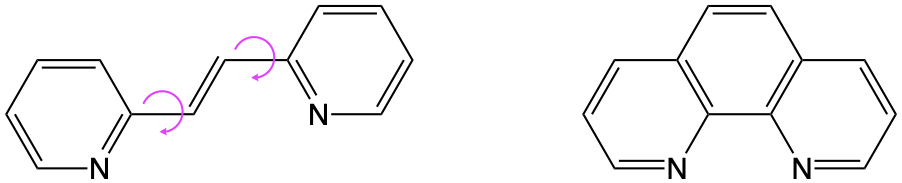
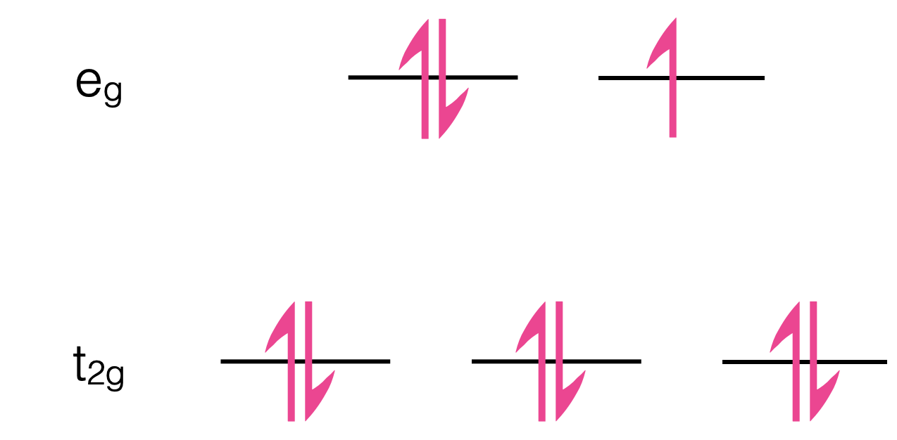

# Workshop Questions for Week 2 Absorption {#ch:Workshop1}

## Questions {#sec:absquestions}

### Short mathematical question - Beer Lambert law {#subsec:BeerLambertSAQ}
- How far can monochromatic 489 nm light travel through a 0.100 M solution of fluorescein with an extinction coefficient at 489 nm of 92000 M^−1^ cm^−1^ before 90 % of it is absorbed?

*(I will use MCQs and UniDoodle to ask this in class)*

### Short conceptual question - molar extinction coefficient {#subsec:MolarExtinction}
- Modify the molecule in figure \@ref(fig:bpy1) to increase the molar extinction coefficient (do not worry about what may happen to wavelength).

```{r echo=FALSE, bpy1, out.width='30%', fig.show='hold', fig.align='center', fig.cap='The structure of bipyridine (also known as bpy).'}
knitr::include_graphics("images/bpy.png")
```

*(I will use UniDoodle's drawing feature to ask this in class)*

### Short conceptual question - intensity of colour {#subsec:intensity}

- What factors influence the ‘intensity of colour’ of the following solutions?

```{r echo=FALSE, molarextstructures1, out.width='70%', fig.show='hold', fig.align='center', fig.cap='The structures of the organic dye methylene blue (left), potassium permanganate (centre) and copper hexa-aqua (right).'}
knitr::include_graphics("images/molarextquestion.png")
```

```{r echo=FALSE, molarextsolutions1, out.width='70%', fig.show='hold', fig.align='center', fig.cap='1 mM solutions of the organic dye methylene blue (right), potassium permanganate (centre) and copper hexa-aqua (left).'}
knitr::include_graphics("images/Molar_extinction_coefficients.png")
```

*(This will be a discussion question)*

### Short conceptual question - line width {#subsec:linewidth}

- Why are some spectra very broad (figure \@ref(fig:rhodaminemol)), whereas others have sharp peaks (figure \@ref(fig:atomictin))?

You will need to look at the x-scale to truley note the difference in the width of these emission spectra.

 
```{r echo=FALSE, rhodaminemol, out.width='70%', fig.show='hold', fig.align='center', fig.cap='The emission spectrum of rhodamine 6G'}
knitr::include_graphics("images/rhodamine6G.png")
```


```{r echo=FALSE, atomictin, out.width='70%', fig.show='hold', fig.align='center', fig.cap='The emission spectrum of Sn(II)'}
knitr::include_graphics("images/atomic_emission_spectrum.png")
```

*(This will be a discussion question)*

### Short conceptual question - the effect of solvation on absorbance {#subsec:solvationabs}

```{r echo=FALSE, ethidiumsolvent, out.width='70%', fig.show='hold', fig.align='center', fig.cap='Ethidium bromide dissolved in from right; water(orange), methanol, ethanol, propanol and butanol(purple)'}
knitr::include_graphics("images/ethidium.png")
```

- Why does the observed colour of ethidium bromide depend upon the solvent (figure \@ref(fig:ethidiumsolvent)))?

Think about the effect of solvation on the energy levels and why those energy levels matter! Remember that if light is transmitted through a solution that is the colour we observe...

*(This will be a discussion question)*


### Extended question - Azobenzene {#subsec:Azobenzene}

Azobenzene undergoes the following cis-trans isomerisation, the isomerisation occurs in the ps timescale.

```{r echo=FALSE, cistransazobenzeneisomerisation, out.width='70%', fig.show='hold', fig.align='center', fig.cap='The cis-trans isomerisation of azobenzene'}
knitr::include_graphics("images/cistransazobenzene.png")
```

- Why would you expect the absorption spectrum of each isomer to be different?

- Suggest why the trans conformation is more stable than the cis isomer. 

- Use the following data to predict the proportion of each isomer under 360 nm excitation.

Table: (\#tab:azobenzeneabs) The molar extinction coefficient of the two isomers of azobenzene.

| | ε~360~ / M^−1^ cm^−1^ | ε~460~ / M^−1^ cm^−1^|
|:--------------|:---------|:---------|
| trans-azobenzene | 22000 | 4500 |
| cis-azobenzene |2100 | 5500 |
 
- Would there be more or less trans azobenzene at 460 nm? Justify your answer.


- It has been suggested the 360 nm absorption is an S~0~ → S~2~ absorption, and the 460 nm band is an S~0~ → S~1~ absorption. Suggest which energy levels are involved for each of the two transitions and compare it to stilbene which has a similar structure, but the cis and trans absorptions are 280 & 295 nm respectively.

```{r echo=FALSE, stilbene, out.width='30%', fig.show='hold', fig.align='center', fig.cap='The  structure of stilbene'}
knitr::include_graphics("images/stilbene.png")
```

*(This will be a discussion question)*

## Answers {#sec:absans}

### Short mathematical question - Beer Lambert law {#subsec:BeerLambertans}
<span style="color: darkcyan;">  - *How far can monochromatic 489 nm light travel through a 0.100 M solution of fluorescein with an extinction coefficient at 489 nm of 92000 M^−1^ cm^−1^ before 90 % of it is absorbed?* 

If 90% of the incident light is being absorbed then 10% of the light is transmitted...

The Beer-Lambert law is (Equation \@ref(eq:BeerLambert)):

\begin{equation}
\log{\frac{I}{I_0}}=-\varepsilon c l
(\#eq:BeerLambert)
\end{equation}

rearranging this:

\begin{equation*}
l = \frac{\log{\frac{I_0}{I}}}{\varepsilon c}
\end{equation*}

\begin{equation*}
l = \frac{\log{\frac{100 \%}{10 \%}}}{92000 \textrm{ M}^{-1} \textrm{ cm}^{-1} \times 0.100 \textrm{ M}}
\end{equation*}

\begin{equation*}
l = \frac{1}{9200000 \textrm{ M}^{-1} \textrm{ m}^{-1} \times 0.100 \textrm{ M}}
\end{equation*}

\begin{equation*}
l = 1.0 \textrm{ μm}
\end{equation*}

### Short conceptual question - molar extinction coefficient {#subsec:MolarExtinctionans}
<span style="color: darkcyan;"> *- Modify the molecule in figure \@ref(fig:bpy1) to increase the molar extinction coefficient (do not worry about what may happen to wavelength).* 

*Image may be found in Section \@ref(subsec:MolarExtinction)*

If a molecule is rigid the difference between the ground and excited state structure is smaller and this usually leads to a higher molar extinction coefficient, so any structural changes which increase this rigidity will likely lead to a higher molar extinction coefficient.

```{r echo=FALSE, bpyalts, out.width='100%', fig.show='hold', fig.align='center', fig.cap='Two possible modifications of bpy, the stilbene derivative on teh left has a very different ground and excited state structure due to the possible rotations around the two conjucated single bonds, the phenantroline modificaiton on the right does not allow much deviation in structure and so the excited state is only bent as the bond order is reduced leading to a larger overlap integral.'}

```

Excitation of an electron from a bonding or non-bonding orbital into an anti-bonding orbital reduces the bond order, and will 'kink' aromatic systems.

### Short conceptual question - intensity of colour {#subsec:intensityans}

<span style="color: darkcyan;">*- What factors influence the ‘intensity of colour’ of the following solutions?*

*Images may be found in Section \@ref(subsec:intensity)*

CuSO~4~ in solution forms the hexa aqua complex listed in figure \@ref(fig:molarextstructures). This is a centrosymmetric molecule which therefore runs foul of the Laporte selection rule which says that "allowed transitions in centrosymmetric molecules must involve a change in parity". So either g → u or u → g are allowed, and g → g and u → u are forbidden.

You will not be expected to work out symetry types for orbitals but can 'back justify' to explain with this.

These symmetry labels appear on the energy level diagram for CU^2+^ (figure \@ref(fig:Cu)).

```{r echo=FALSE, Cu, out.width='40%', fig.show='hold', fig.align='center', fig.cap='The splitting of the d-orbitals in octahedral Cu2+, the transition is between the HOMO t2g level and the PUMO eg level. The subscript g on each of these orbitals is a symmetry label indicating there is no change or parity and so the transition is Laporte forbidden.'}

```

Both of the split energy levels are gerade (g) and so there is no change of parity for the transition from t~2g~ to e~g~, therefore the transition is selection rule forbidden and has a low molar extinction coefficient. The 'breaking of symmetry' by possible rotamers of the water ligands mean this value is higher than for the gas phase atomic molar absorption coefficient. The maximum molar extinction coefficient of copper sulfate solutions is around 20 M^-1^ cm^-1^.

The permanganate (MnO~4~^-^) is a ligand to metal charge transfer transition, since excitation of an electron effectively moves an electron from one of the oxygen ligands to the manganese 'empty' metal centre there is no limitation from the spin selection rule and the complex is not subject to the Laporte selection rule. This leads to moderate to 'high' molar extinction coefficients. The maximum molar extinction coefficient of potassium permanganate solutions is around 1800 M^-1^ cm^-1^.

The final molecule is the synthetic dye methylene blue, this is not centrosymmetric and so is not subject to the Laporte selectrion rule, further the structure with fused aromatic rings and a large amount of conjugation is fairly rigid and so there is a large overlap of the wavefunctions of the ground and excited state. The maximum molar extinction coefficient of methylene blue solutions is around 75000 M^-1^ cm^-1^.

### Short conceptual question - line width {#subsec:linewidthans}

<span style="color: darkcyan;"> - *Why are some spectra very broad (figure \@ref(fig:molecular)), whereas others have sharp peaks (figure \@ref(fig:atomic))?*

<span style="color: darkcyan;">*You will need to look at the x-scale to truley note the difference in the width of these emission spectra.*

*Images may be found in Section \@ref(subsec:linewidth)*

We are looking at two very different spectra here, first off we have an atomic transition and a molecular transition. Secondly one is solvated, the other in the gas (or more acurately plasma) phase. Both of these factors are important...

When we have a transition for either absorption or emission then on an atomic level those energy levels are incredibly well defined, this leads to the energy required to promote an electron between these levels to be equally well defined.

As soon as we solvate this the energy of the occupied (HOMO) is softened as intermolecular interactions will stabilise this level to different amounts, solvation may also allow previously absolutely parity forbidden processes to occur.

The molecular spectrum is much broader because each of the possible rotamers, vibratamers and isomers has a slightly different energy, the myriad possible energies are expanded still by solvation and tempeature effects. The more possible structural isomers and rotamers the 'softer' any defining features in the spectrum. For example if we compare the rhodamine spectum (figure \@ref(fig:molecular)) to that of antracene (figure \@ref(fig:anthracene)) we can see that there is more 'fine structure' in the anthracene spectrum, this is because of the smaller possible number of structural variations, there are no possible rotamers and so transitions are more defined.

```{r echo=FALSE, anthracene, out.width='70%', fig.show='hold', fig.align='center', fig.cap='The absorption and emission spectra of anthracene indicating fine structure in the spectrum'}
knitr::include_graphics("images/anthracene.png")
```

### Short conceptual question - the effect of solvation on absorbance {#subsec:solvationabsans}

*Image may be found in Section \@ref(subsec:solvationabs)*

<span style="color: darkcyan;"> - *Why does the observed colour of ethidium bromide depend upon the solvent (figure \@ref(fig:ethidium)))?* 

<span style="color: darkcyan;"> *Think about the effect of solvation on the energy levels and why those energy levels matter! Remember that if light is transmitted through a solution that is the colour we observe...* 
 
This is in essence answering the same question as in question \@ref(sec:linewidth), solvation affects the energy levels of occupied orbitals.WIthout going into any more detail than essential the different solvents stabilise the HOMO of ethidium bromide different amounts - this is likely due to different hydrogen bonding of the alchols. The more stabilised the ground state the bigger the energy gap leading to a blue shift in the absorption spectra. The orange solution is absorbing blue light (λ~max~ = 480 nm) and the purple solution absorbing orange  (λ~max~ = 550 nm) indicating the energy gap of the aquous solution is larger and therefore the solvent stabilisation is biggest.

It is worth noting that the energy of 'empty' orbitals is unaffected and so the energy of the LUMO is unchanged (figure \@ref(fig:solvato)).

*Figure above in Section \@ref(subsec:solvationabs)*

### Extended question - Azobenzene {#subsec:Azobenzeneans}

<span style="color: darkcyan;"> *Azobenzene undergoes the following cis-trans isomerisation, the isomerisation occurs in the ps timescale.* 

*Image may be found in Section \@ref(subsec:Azobenzene)*

<span style="color: darkcyan;"> - *Why would you expect the absorption spectrum of each isomer to be different?* 

Trans azobenzene is centrosymmetric and so is subject to the Laporte selection rule, cis azobenzene is non-centrosymmetric and so it is not parity forbidden. Consequently the HOMO-LUMO transition which is allowed for the cis is forbidden for the trans and so the absorbance spectra is different.

<span style="color: darkcyan;"> - *Suggest why the trans conformation is more stable than the cis isomer.*

Steric hinderance will mean that the cis-isomer is not planar, if it isn't planar it isn't fully conjugated, and if it isn't fully conjugated it isn't as stable. There is no steric hinderance in the trans isomer.

 <span style="color: darkcyan;">- *Use the following data to predict the proportion of each isomer under 360 nm excitation.* 

 <span style="color: darkcyan;"> *Table: (\#tab:azobenzeneabs) The molar extinction coefficient of the two isomers of azobenzene.*

| | ε~360~ / M^−1^ cm^−1^ | ε~460~ / M^−1^ cm^−1^|
|:--------------|:---------|:---------|
| trans-azobenzene | 22000 | 4500 |
| cis-azobenzene |2100 | 5500 |
 
For the photostationary state the absorbance of the two isomers will be the same.

The excited state for both molecules will be the same, and the probability of the excited state decaying into any given  isomer is the same.

So if $A =\varepsilon cl$ and $A_{trans}=A_{cis}$ then at 360 nm:

\begin{equation*}
\varepsilon_{trans} c_{trans} = \varepsilon_{cis} c_{cis}
\end{equation*}

$c_{trans}= 0.095 c_{cis}$

<span style="color: darkcyan;"> - *Would there be more or less trans azobenzene at 460 nm? Justify your answer.*

There would be more trans at the photostationary state when excited at 460 nm, this is because the relative ration of molar extinction coefficients favors formation of more of the trans isomer.

<span style="color: darkcyan;"> - *It has been suggested the 360 nm absorption is an S~0~ → S~2~ absorption, and the 460 nm band is an S~0~ → S~1~ absorption. Suggest which energy levels are involved for each of the two transitions and compare it to stilbene which has a similar structure, but the cis and trans absorptions are 280 & 295 nm respectively.*

*Image may be found in Section \@ref(subsec:Azobenzene)*

Azobenzene has $n$, $\pi$ and $\pi^*$ orbitals whereas stilbene only has $\pi$ and $\pi^*$ orbitals. Given the different orbital types available in azobenzene the expectation that the transitions will have a wider energy spacing than in stilbene where we just have the bonding and antibonding $pi$ set, and so we would expect these energy levels to be more closely spaced.
