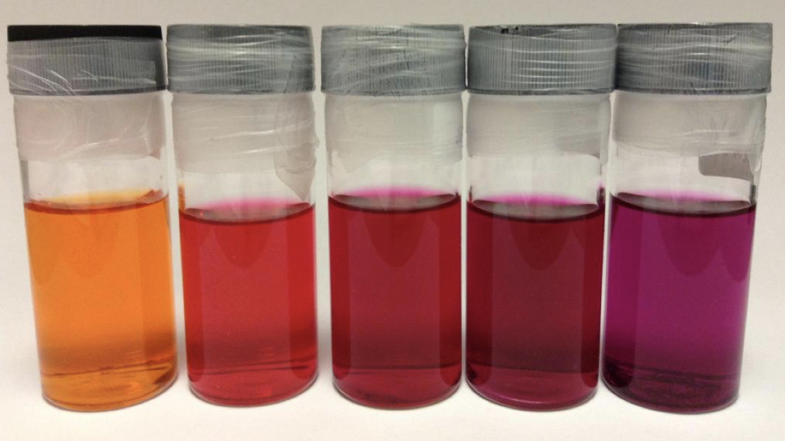

# Workshop Questions for Week 2 Absorption {#ch:Workshop1}

## Short mathematical question - Beer Lambert law {#sec:BeerLambertSAQ}
- How far can monochromatic 489 nm light travel through a 0.100 M solution of fluorescein with an extinction coefficient at 489 nm of 92000 M^−1^ cm^−1^ before 90 % of it is absorbed?

*(I will use MCQs and UniDoodle to ask this in class)*

## Short conceptual question - molar extinction coefficient {#sec:MolarExtinction}
- Modify the molecule in figure \@ref(fig:bpy1) to increase the molar extinction coefficient (do not worry about what may happen to wavelength).

```{r echo=FALSE, bpy1, out.width='30%', fig.show='hold', fig.align='center', fig.cap='The structure of bipyridine (also known as bpy).'}
knitr::include_graphics("images/bpy.png")
```

*(I will use UniDoodle's drawing feature to ask this in class)*

## Short conceptual question - intensity of colour {#sec:intensity}

- What factors influence the ‘intensity of colour’ of the following solutions?

```{r echo=FALSE, molarextstructures1, out.width='70%', fig.show='hold', fig.align='center', fig.cap='The structures of the organic dye methylene blue (left), potassium permanganate (centre) and copper hexa-aqua (right).'}
knitr::include_graphics("images/molarextquestion.png")
```

```{r echo=FALSE, molarextsolutions1, out.width='70%', fig.show='hold', fig.align='center', fig.cap='1 mM solutions of the organic dye methylene blue (right), potassium permanganate (centre) and copper hexa-aqua (left).'}
knitr::include_graphics("images/Molar_extinction_coefficients.png")
```

*(This will be a discussion question)*

## Short conceptual question - line width {#sec:linewidth}

- Why are some spectra very broad (figure \@ref(fig:rhodaminemol)), whereas others have sharp peaks (figure \@ref(fig:atomictin))?

You will need to look at the x-scale to truley note the difference in the width of these emission spectra.

 
```{r echo=FALSE, rhodaminemol, out.width='70%', fig.show='hold', fig.align='center', fig.cap='The emission spectrum of rhodamine 6G'}
knitr::include_graphics("images/rhodamine6G.png")
```


```{r echo=FALSE, atomictin, out.width='70%', fig.show='hold', fig.align='center', fig.cap='The emission spectrum of Sn(II)'}
knitr::include_graphics("images/atomic_emission_spectrum.png")
```

*(This will be a discussion question)*

## Short conceptual question - the effect of solvation on absorbance {#sec:solvationabs}

```{r echo=FALSE, ethidiumsolvent, out.width='70%', fig.show='hold', fig.align='center', fig.cap='Ethidium bromide dissolved in from right; water(orange), methanol, ethanol, propanol and butanol(purple)'}

```

- Why does the observed colour of ethidium bromide depend upon the solvent (figure \@ref(fig:ethidiumsolvent)))?

Think about the effect of solvation on the energy levels and why those energy levels matter! Remember that if light is transmitted through a solution that is the colour we observe...

*(This will be a discussion question)*


## Extended question - Azobenzene {#sec:Azobenzene}

Azobenzene undergoes the following cis-trans isomerisation, the isomerisation occurs in the ps timescale.

```{r echo=FALSE, cistransazobenzeneisomerisation, out.width='70%', fig.show='hold', fig.align='center', fig.cap='The cis-trans isomerisation of azobenzene'}

```

- Why would you expect the absorption spectrum of each isomer to be different?

- Suggest why the trans conformation is more stable than the cis isomer. 

- Use the following data to predict the proportion of each isomer under 360 nm excitation.

Table: (\#tab:azobenzeneabs) The molar extinction coefficient of the two isomers of azobenzene.

| | ε~360~ / M^−1^ cm^−1^ | ε~460~ / M^−1^ cm^−1^|
|:--------------|:---------|:---------|
| trans-azobenzene | 22000 | 4500 |
| cis-azobenzene |2100 | 5500 |
 
- Would there be more or less trans azobenzene at 460 nm? Justify your answer.


- It has been suggested the 360 nm absorption is an S~0~ → S~2~ absorption, and the 460 nm band is an S~0~ → S~1~ absorption. Suggest which energy levels are involved for each of the two transitions and compare it to stilbene which has a similar structure, but the cis and trans absorptions are 280 & 295 nm respectively.

```{r echo=FALSE, stilbene, out.width='30%', fig.show='hold', fig.align='center', fig.cap='The  structure of stilbene'}
knitr::include_graphics("images/stilbene.png")
```

*(This will be a discussion question)*
