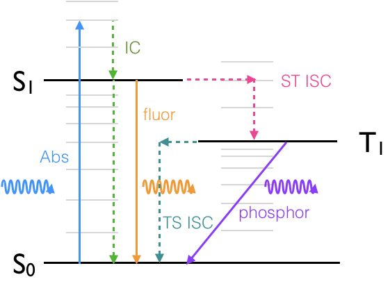
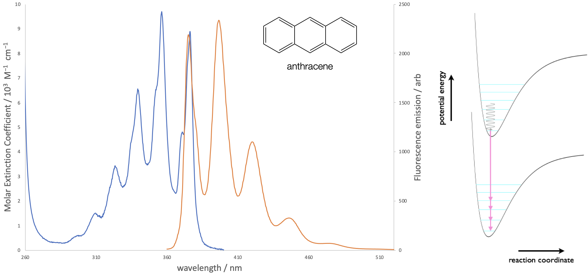
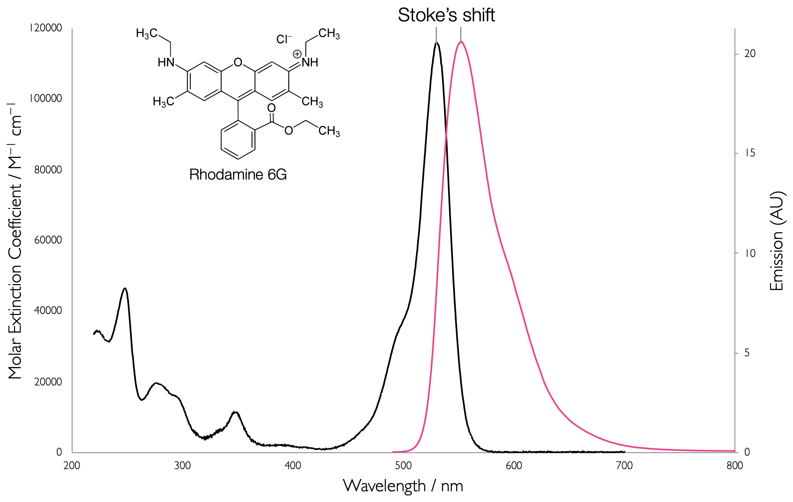
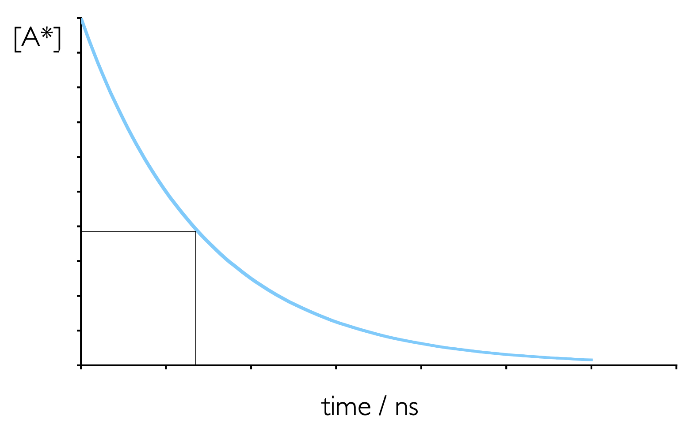

# Emission of Light {#ch:Em}

### Learning Objectives {#sec:EmLOs}


At the end of this block you should be able to:

- Define singlet and triplet states in terms of molecular orbitals

- Explain the mirror symmetry observed in absorption/fluorescence spectra.

- Construct and explain the Jablonski diagram.

- Define the rates of the processes in the Jablonski scheme and give typical values for the rate constants.

- Define singlet and triplet lifetimes and describe how they are measured.

- Analyse decay curves to obtain lifetimes of excited states.

- Define and derive the quantum yield of fluorescence and phosphorescence.


Only the light absorbed by a molecule can produce photochemical change in a molecule. If a species absorbs radiation then one particle is excited for each quantum of radiation absorbed. This concept of light having to be absorbed before anything else can happen is an obvious one, but is an important concept in itself, it goes on to define the concept of quantum yield of a process, effectively the proportion of excited states which ‘decay’ to any given pathway.

The reaction coordinate, which appears on our x axis of any plot with potential wells, is essentially a measure of the net difference between the wavefunction of ground and excited state, the bigger the difference the bigger the offset on the reaction coordinate axis.

Wavefunctions are hard to visualise though, and so we may also consider it the sum of the net difference in position of every atom between the ground and excited state, the bigger the structural change, the bigger the difference in wavefunction, and so the bigger the offset on the reaction coordinate axis.

<iframe width="768" height="432" src="https://www.youtube.com/embed/xhTzJr4jlf0" title="YouTube video player" frameborder="0" allow="accelerometer; autoplay; clipboard-write; encrypted-media; gyroscope; picture-in-picture" allowfullscreen></iframe>

## Fluorescence & Phosphorescence {#sec:FluorPhos}

Just as there are ‘spin forbidden’ and ‘spin allowed' processes for absorption, when the molecule is in an excited state there are a allowed and forbidden path ways of deactivation of the excited state.

If we look at a Jablonski diagram, figure 19, which you should already be familiar with, it shows the range of photophysical deactivation pathways of an excited state.

A Jablonski diagram (figure \@ref(fig:Jablonski)) usually uses a short hand to refer to the excited states, where a ground state, if it is a singlet, is referred to as S~0~, and each subsequent excited state is referred to as S~1~, S~2~ *etc*.

```{r echo=FALSE, Jablonski, out.width='70%', fig.show='hold', fig.align='center', fig.cap='Jablonski diagram showing: A, the absorption of a photon, and the photophysical deactivation pathways, IC, internal conversion, ISC, intersystem crossing, F, fluorescence \\& P, phosphorescence.'}

```

Triplet states are referred to as T~1~, T~2~… if the ground state is not a triplet then there is no state labelled T~0~. All excited states are referred to by integer vales of 1 or more.

*A note on Jablonski diagrams: transitions which are either allowed or non-radiative and therefore not governed by selection rules appear as either horizontal or vertical transitions, forbidden transitions (such as phosphorescence) are indicated by transitions which occur at an angle. Radiative transitions (those that occur with either the absorption or emission of a photon) are shown as solid lines with the incident or excident photon shown as a wave like arrow. Non radiative transitions are shown as dashed (or alternatively wiggly) lines to clearly differentiate them from radiative transitions. Transitions with a change of spin are isoenergetic (shown as horizontal lines) before decaying via internal conversion (vertical lines). A Jablonski diagram is a sketch of the energy levels and should not include details of the potential wells of either the ground or excited state.*

The spin selection rule which applies for absorption transitions $\Delta S = 0$, so formally emission transitions from the S~1~ to S~0~ are spin allowed, allowed emission transitions are referred to a fluorescence. 

Emission transitions that involve a change in spin of the electron, such as from T~1~ to S~0~, are spin forbidden, and referred to as phosphorescence. The excited state can also decay via non-radiative transitions and other routes. 

Table \@ref(tab:phototrans) the deactivation pathways from excited states:

Table: (\#tab:phototrans) The excitation and decay pathways in molecules.

| | | |
|:--------------|:---------|:---------|
|*'Allowed transitions'*| | |
|Singlet-singlet absorption <br> Singlet-singlet emission|<br> fluorescence | $S_0 + h \nu \longrightarrow S_1$ <br> $S_1 \longrightarrow S_0 + h \nu '$|
|*'Forbidden transitions'*|||
|Singlet-triplet absorption <br> Triplet-singlet emission|<br> fluorescence | $S_0 + h \nu \longrightarrow T_1$ <br> $T_1 \longrightarrow S_0 + h \nu ''$|
|*'Other transitions'* | | |
|Internal conversion <br> <Intersystem crossing> <br> <Intersystem crossing>  | (vibrational relaxation) <br> <br> (vibrational relaxation) | $S_1 \longrightarrow S_0 + heat$ <br> $S_1 \longrightarrow T_1 + heat$ <br> $T_1 \longrightarrow S_0 + heat$|
|*Other pathways*| | |
Quenching of excited state <br> <br> <br> Chemistry from excited state| | $S_1 + Q \longrightarrow S_0 + Q +heat$ <br> $S_1 + Q \longrightarrow S_0 + Q^\ast +heat$ <br> $T_1 + Q \longrightarrow S_0 + Q +heat$ <br> $T_1 + Q \longrightarrow S_0 + Q^\ast +heat$ <br> $S_1 \longrightarrow$ new/changed molecule |


The spin selection rule has important consequences on the lifetime of singlet and triplet states. The spin allowed process of fluorescence usually has a short lifetime (less than 10 ns), whereas the spin forbidden process of phosphorescence has a significantly longer lifetime,  which can be as long as several seconds.

Vibrational relaxation occurs in the ps timescale, consequently the excited state decays vibrationally to the S~1~, v’ = 0 state and emission essentially always occurs from the ground vibrational electronically excited state. This is an important concept in photophysics and is called Kasha’s rule.

### Kasha's Rule {#sec:Kasha}

*An excited state always emits from the lowest energy level of that spin multiplicity state.*

The Frank-Condon principle applies equally to emission processes and the excited state will decay to a number of available vibrationally excited states of the ground electronic state. After relaxation to the $v’ = 0$ level emission occurs to each of the available vibrational states of the ground state.  The relative intensity of each band depends upon the coupling or overlap integral between the ground and excited states, as shown in figure \@ref(fig:anthracenekasha).

```{r echo=FALSE, anthracenekasha, out.width='70%', fig.show='hold', fig.align='center', fig.cap='The absorption and emission spectra of anthracene in ethanol solution. Both the absorption and emission spectra show vibrational fine structure, due to transitions to discrete vibrational energy levels in the excited and ground states respectively.'}

```

## Stoke's shift {#sec:stoke}

The Franck-Condon factors in absorption and emission is clearly evident by the symmetry shown in the emission of most organic chromophores. The Stoke’s shift, the difference between the $v=0$ to $v’=0$ absorption peak and the $v’=0$ to $v=0$ emission peak, can simply be explained by the offset of the ground and excited state potential wells (figure \@ref(fig:stokesspectrum)). Absorption happens from the centre of the $v=0$ ground state and emission from the centre of the $v’=0$ excited state, however this does not explain why the two curves are offset from one another.

```{r echo=FALSE, stokesspectrum, out.width='70%', fig.show='hold', fig.align='center', fig.cap='The absorption and emission spectra of rhodamine 6G showing the Stokes shift of the two spectra.[Data from [OMLC](https://omlc.org/spectra/PhotochemCAD/html/083.html), accessed July 2020]'}

```

The axis title of ’reaction coordinate’ is used ubiquitously, but is poorly understood. The simple idea that a bond becomes longer (as would be the case for a diatomic molecule) does not apply as we are considering the whole molecule.

The Stokes shift can be far more easily accounted for if we consider what is going on in the molecule. Initially the molecule exists in a state optimised for for that state, the shape and structure of the dye molecule and the arrangement of solvent around it are all minimised to give the lowest energy configuration. We shall consider the most simple case of the transitions between the ground vibrational states of the HOMO & LUMO.

Absorption of a photon is a very fast process, in the order of femtoseconds, and is significantly faster than molecular vibrations or structural reorganisation. Consequently the molecule becomes excited into a state which has exactly the same structural configuration and salvation shell as the ground state, however this is now no longer the most optimal state, figure \@ref(fig:stokesenergy).

```{r echo=FALSE, stokesenergy, out.width='80%', fig.show='hold', fig.align='center', fig.cap='Sketch of the photophysical processes involved in the Stokes shift of emission. The ground state structure of the dye and solvent sphere (lower left) is maintained upon almost instantaneous absorption of a photon, however this then relaxes to an optimised configuration of dye and solvent for the excited state (top right), however this destabilises the ground state.'}
knitr::include_graphics("images/stokesenergy.png")
```

Since the excited state is relatively stable (ns) when compared with the time taken for vibrations and molecular restructuring (ps) the excited state dye molecule and the solvent will reorganise to minimise the energy of the excited state, however in doing so this destabilises the ground state of the molecule. The actual process of emission is again very fast (ps) and so there is no opportunity for the structure of the chromophore or solvation sphere to reorganise. Upon deactivation this state, optimised for the excited state reorganises, lowering the energy of the ground state and destabilising the excited state.

As a consequence of this stabilising action of the ground and excited states the energy gap of absorption is larger than the energy gap of emission, or the emission of a photon is redshifted from the absorption. This explains the origin of Stokes shift, and explains the offset the Morse curves of the ground and excited states which have previously been used to explain the origin of the Stokes shift.

<div style="text-align: center;"><iframe width="480" height="360" src="https://www.youtube.com/embed/KOHAMTBKvDA" frameborder="0" allow="accelerometer; autoplay; encrypted-media; gyroscope; picture-in-picture" allowfullscreen></iframe></div>

## Emission from S~2~ {#sec:azuleneS2}

Kasha’s rule is almost always true, but there are known exceptions to this rule, one of these examples is azulene. Azulene has a broad absorption band between 500-600 nm, however emission from this molecule occurs at below 400 nm. If we look at figure \@ref(fig:azulene) which shows the absorption and emission spectra of azulene it can be seen that the emission spectra is a mirror image of S~0~-S~2~ (excitation into the second excited electronic state) absorption band, indicating the emission is also from the S~2~ to S~0~ states.

```{r echo=FALSE, azulene, out.width='60%', fig.show='hold', fig.align='center', fig.cap='The absorption (solid line) and emission (dashed line) spectrum of azulene in ethanol. Note the emission appears in the near UV part of the spectrum. '}
knitr::include_graphics("images/azulene.png")
```

The molar extinction coefficient is also significantly higher for this S~0~-S~2~ absorption indicating a much greater overlap integral of these two states. 

What causes the unusual photophysical example? In short there is a very large energy gap between the S~2~ and S~1~ excited states this has the effect of greatly reducing the rate of internal conversion. There is a very weak emission from the S~1~ to S~0~, in this case the energy gap is relatively small and there is an efficient deactivation of the excited state by internal conversion.

<div style="text-align: center;"><iframe width="480" height="360" src="https://www.youtube.com/embed/AXqZmv7HfxQ" frameborder="0" allow="accelerometer; autoplay; encrypted-media; gyroscope; picture-in-picture" allowfullscreen></iframe></div>

## Rates of Photophysical Processes & Quantum Yield {#sec:ratesphoto}

Fluorescence (and phosphorescence) are first order processes, just like radioactive decay. The probability of a molecule decaying from an excited state depends only the concentration of that excited state, $[A^\ast]$.

Rate of decay of $[A^\ast]$:

\begin{equation}
\frac{\textrm{d}[A^\ast]}{\textrm{d}t}=-k_f [A^\ast]
(\#eq:fluordecay)
\end{equation}

It is usual to refer to the ‘lifetime’ of photophysical processes, and it is a term already used at the start of this chapter, the lifetime of a process, usually given the symbol τ, is the reciprocal of the rate constant for that process, so τ~f~ = 1/k~f~. Often the natural lifetime of a dye is used, this assumes that there are no other deactivation pathways from the excited state and all of the energy is lost as fluorescence (or the fluorescence quantum yield is 1). The natural lifetime of fluorescence is given the symbol τ~f~^0^, it is the maximum a lifetime can be and is solvent dependent.

If there is more than one possible deactivation pathway from the excited state is is often useful to be able to quantify these values. The quantum yield of a process describes the efficiency of each process, when a molecule absorbs a photon of light it generates an excited state; there are a number of different ways the molecule can decay from this excited state (see section \@ref(sec:FluorPhos), figure \@ref(fig:Jablonski)). The quantum yield for each process is essentially the ratio of reactions proceeding down each pathway and the number of photons absorbed, quantum yield has no units.

\begin{equation}
\phi = \frac{\textrm{number of reactions proceeding down a given pathway}}{\textrm{number of photons absorbed}}
(\#eq:QYdef)
\end{equation}

Table: (\#tab:QYtab) The deactivation pathways of an excited state, with the associated rate constants and quantum yields.

|  |  | Rate of Process | Quantum Yield |
|:----------------|:-----------|:-------|:-------|
| Absorption | $S_0 + h \nu \longrightarrow S_1$ | $I$ | |
| Fluorescence | $S_1 \longrightarrow S_0 + h \nu'$ | $k_f[S_1]$ | $\phi _f$ |
| Internal conversion | $S_1 \longrightarrow S_0 + \textrm{heat}$ | $k_{ic}[S_1]$ | $\phi _{ic}$ |
| Intersystem crossing <br> *singlet to triplet*| $S_1 \longrightarrow T_1 + \textrm{heat}$ | $k_{ST}[S_1]$ | $\phi _{ST}$ |
| Phosphorescence | $T_1 \longrightarrow S_0 + h \nu''$ | $k_p[T_1]$ | $\phi _p$ |
| Intersystem crossing <br> *internal conversion triplet to singlet*| $T_1 \longrightarrow S_0 + \textrm{heat}$ | $k_{TS}[T_1]$ | $\phi _{TS}$ |

According to the Stark-Einstein law the total quantum yield of all processes is unity (one), however if secondary reactions occur (such as radical propagation) it may be more than 1. The quantum yield and rate of a process are intrinsically linked. It should be implicit that the faster the rate of a process (the bigger the rate constant) the bigger the quantum yield of that process; in fact the quantum yield of a process, such as fluorescence, is the rate of fluorescence divided by the sum of the rates of all of the deactivation processes (equation \@ref(eq:QYfluor)).

\begin{equation}
\phi_f = \frac{k_f^0}{k_f^0+k_{ic}+ k_{ST}+k_{\textrm{other}}}
(\#eq:QYfluor)
\end{equation}

(Examples of expressions for other processes may be found in Section \@ref(sec:SSQemissionans) equations \@ref(eq:QYIC), \@ref(eq:QYST) & \@ref(eq:QYTS).)

When there are more processes occurring then the singlet lifetime (sometimes called the fluorescence lifetime) will be smaller than the natural fluorescence lifetime, because now the denominator term is bigger (equation \@ref(eq:lifetimefluor)).

\begin{equation}
\tau_S = \frac{1}{k_f^0+k_{ic}+ k_{ST}+k_{\textrm{other}}}
(\#eq:lifetimefluor)
\end{equation}

If we assume that there is no quenching of the system (this is discussed later) and no chemistry the only decay pathways from the excited state are emission (fluorescence), internal conversion and intersystem crossing to the triplet state, and so consequently only these terms would appear in the equation for the quantum yield. Processes that occur from the triplet state are independent, and therefore none of these terms occur in quantum yield or lifetime equations from the singlet, fluorescent state.

<div style="text-align: center;"><iframe width="480" height="360" src="https://www.youtube.com/embed/6YXXhcR9yDw" frameborder="0" allow="accelerometer; autoplay; encrypted-media; gyroscope; picture-in-picture" allowfullscreen></iframe></div>

For processes that occur from the triplet state, then obviously, the quantum yield will depend upon the total number of triplet states produced, which is given by the quantum yield of intersystem crossing. So the quantum yield of phosphorescence is given by:

\begin{equation}
\phi_p = \frac{k_p^0}{k_p^0+k_{TS}+k_{\textrm{other}}}
(\#eq:QYphos)
\end{equation}

Quantum yields of photophysical processes can be difficult to measure, in part because it is difficult to easily quantify the number of photons going into a sample, and because emission occurs at all angles from the sample. A technique called ‘actinometry’ is usually used where the emission from an unknown sample is compared with that of a well characterised sample.

A good actinometer should have a good overlap in both the absorption and emission spectra, a high molar absorption coefficient, it should be photochemically stable and have a high emission quantum yield, a selection of well characterised actinometers are included in figure \@ref(tab:actinometer). Measurements on the absorption at the excitation wavelength, and the full emission spectra are required for both the unknown and the actinometer, as well as details on the reactive index of the solvents used. For best results a monochromatic light source should be used (a laser) and the same excitation wavelength must be used for both samples; the absorbance of the solutions should also be low (<0.1).

Usually emission spectra are measured as intensity against wavelength, but when ‘integrating’ the emission of the unknown and actinometer it is important that they are integrated over a linear space (energy or frequency) which can make calculations more difficult (but perfectly doable in something like Excel). Equation \@ref(eq:actinometry) shows the relationship between the fluorescence quantum yield of an unknown, Φ, with that of a reference actinometer, Φ~R~. A is the absorbance at the excitation wavelength, and n the refractive index of the solvent. Here, because all terms appear as ratios there is no need to worry about units with anything.

\begin{equation}
\phi=\phi_R \frac{\int{I}\textrm{d}\bar \nu}{\int{I_R}\textrm{d}\bar \nu}\frac{A_R}{A}\frac{n^2}{n^2_R}
(\#eq:actinometry)
\end{equation}

The integrated emission intensity, $\int{I}\textrm{d}\bar \nu$, of the unknown and reference is here shown as being integrated over wavenumber, but so long as it is integrated over linear space^[The term linear space implies the steps are the same size, energy is the more fundamental unit, since wavelength is a reciprical function of energy wavelength space is non linear.] it does not matter if frequency or energy is used instead as any units from the terms cancel.

Table: (\#tab:actinometer) The photophysical details of well characterised actinometers.

| Reference | Solvent | λ~ex~/nm |  Φ~em~ |  λ~em,max~ / nm |
|:--------|:--------|:----|:----|:----|
| quinine sulfate | 0.1 M H~2~SO~4~ | 350 | 0.577 | 444 |
| fluorescein | 0.1 M H~2~SO~4~ | 496 | 0.95 | 521 |
| rhodamine 6G | ethanol | 488 | 0.94 | 530 |
| cresyl violet | methanol | 540 | 0.54 | 622 |

## Fluorescence lifetime

Spontaneous emission (either fluorescence or phosphorescence) from an excited state is a first order process, and so shows similar kinetics to that which you have already studied, figure \@ref(fig:fluorlifetime) & equation \@ref(eq:fluorlifetime).

```{r echo=FALSE, fluorlifetime, out.width='50%', fig.show='hold', fig.align='center', fig.cap='Emission from an excited state is a first order process, whereby an excited state decays spontaneously. The emission lifetime is the time required for the concentratio of an excited state to fall to 1/e of its initial value.'}

```

However, instead of using rate constants when talking about this decay (as seen in Section \@ref(sec:ratesphoto) photochemists tend to talk about emission lifetimes, $\tau$.

The fluorescence lifetime is defined as the time required for the concentration of excited state to fall to 1/e (~0.3679) of the initial concentration.

So for an excited singlet state the fluorescence lifetime is related to the concentrations as follows:

\begin{equation}
[S_1]_t=[S_1]_0e^-{\frac{t}{\tau}}
(\#eq:fluorlifetime)
\end{equation}

where $\tau$ is the value given in equation \@ref(eq:lifetimefluor).

<div style="text-align: center;"><iframe width="480" height="360" src="https://www.youtube.com/embed/efs_ro_mV2A" frameborder="0" allow="accelerometer; autoplay; encrypted-media; gyroscope; picture-in-picture" allowfullscreen></iframe></div>


## Before Completing this Section

To support the material in this section it is suggested you read chapters 3 & 4 of Wardle ‘Principles and Application of Photochemistry’.


