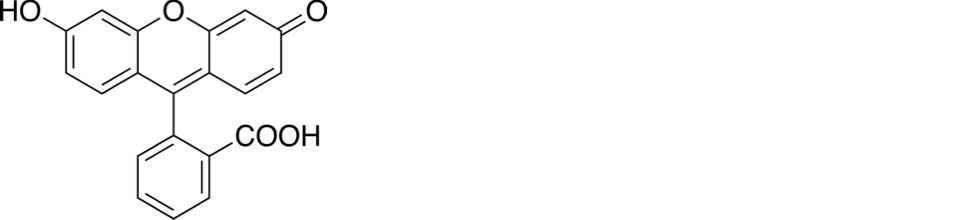
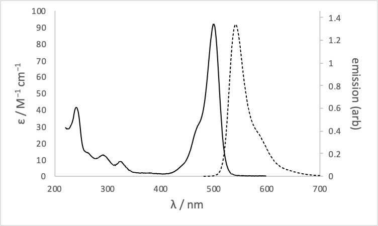
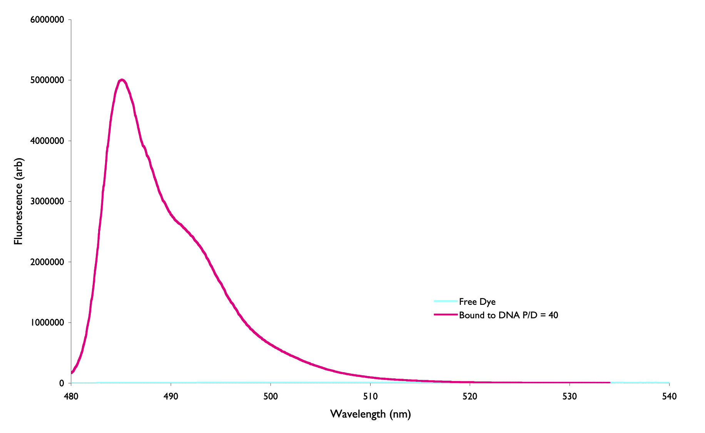
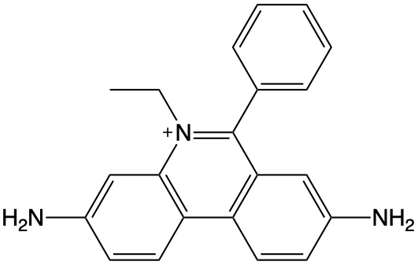
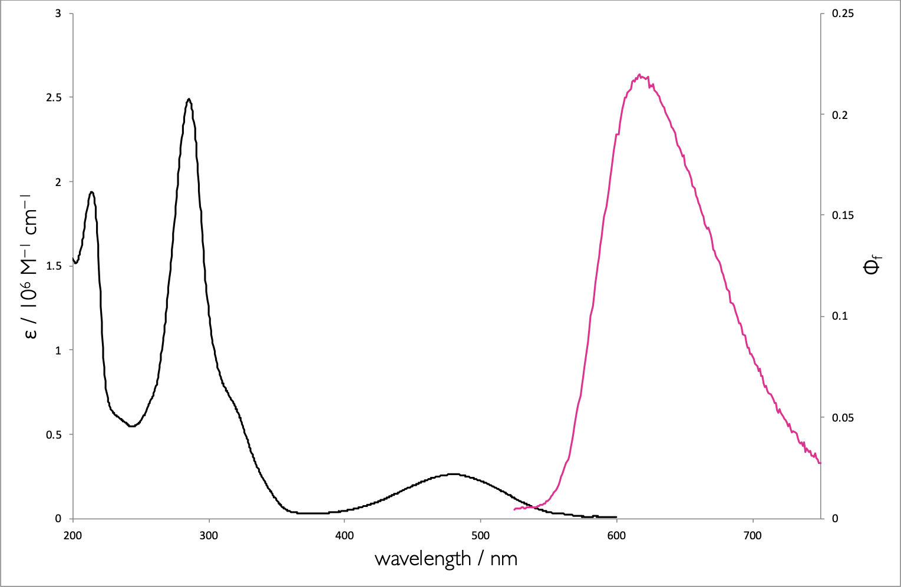

# Workshop Questions for Week 3 {#ch:Workshop2}

## Short mathematical question - Quantum Yield and lifetime {#sec:YieldLifetime}
The quantum yield and lifetime of a dye were measured to be 0.43 & 2.6 ns respectively. What is the natural lifetime?

*(I will use MCQs and UniDoodle to ask this in class)*


## Short conceptual question - Effect of other processes {#sec:otherprocesses}

For a given value of τ~0~ what happens to the lifetime and quantum yield as k~IC~ and k~ISC~ increases?


*(This will be a discussion question)*

## Conceptual question - Effect of structure {#sec:structure}
Fluorescein (figure \@ref(fig:fluorescein)) in basic aqueous solution has a quantum yield of fluorescence, Φ~f~, of 0.95, and fluorescence lifetime, τ~f~, of 4.1 ns.

```{r echo=FALSE, fluorescein, out.width='70%', fig.show='hold', fig.align='center', fig.cap='The structure of the fluorescent molecule fluorescein'}

```

*(This will be a discussion question)*

## Conceptual question - lack of symmetry in spectra.

The absorption and emission spectrum of fluorescein is shown in figure (\@ref(fig:fluoresceinspec))

```{r echo=FALSE, fluoresceinspec, out.width='70%', fig.show='hold', fig.align='center', fig.cap='The absorption (solid) and emission (dashed) spectrum of fluorescein in basic ethanol.'}

```

Why are the absorption bands between 200 – 350 nm not reflected in the emission spectrum?

## Conceptual question - Stokes' shift {#sec:stokes}

The inorganic dye [Ru(bpy)~3~]^2+^ has a measured lifetime in water of 580 ns and a natural lifetime of 13.8 µs. The spectrum is shown in figure \@ref(fig:Rubpyspec). What is the origin of the large Stokes' shift in this system?

```{r echo=FALSE, Rubpyspec, out.width='70%', fig.show='hold', fig.align='center', fig.cap='The absorption (black) and emission (red) spectrum of ruthenium tris bypyridine in water.'}
knitr::include_graphics("images/Rubpy3spectra.png")
```

Data from Shi *et al.*, Synthesis and characterization of phosphorescent two coordinate copper(I) complexes bearing diamidocarbene ligands. [Dalton Trans., 2017,46, 745-752.](https://doi.org/10.1039/C6DT04016K)

## Conceptual question - the effect of binding on emission {#sec:binding}

The asymmetric cyanine dye YO-Pro-1 is a DNA stain because it has a large increase on fluorescence emission when binding to DNA. The lifetime in free solution is around 2 ps and when bound to DNA is 2.4 ns. What is the structural origin of the large increase of emission upon binding?

```{r echo=FALSE, YODNA, out.width='70%', fig.show='hold', fig.align='center', fig.cap='The emission spectrum of the choromophore YO-Pro-1 when free in aqueous solution (blue) and when bound to DNA (pink)'}

```

*(This will be a discussion question)*


## Extended question - Properties of Ethidium Bromide (Example Exam Question)

Ethidium bromide (EB, figure \@ref(fig:ethidiumstructure) is used as a DNA stain, which is essentially non-fluorescent in aqueous solution, but shows a strong enhancement of emission upon binding to double stranded DNA (which has a negatively charged backbone).

Emission is almost exclusively from the singlet excited state, but a triplet state has been shown to exist, which emits with a low quantum yield (Φ~P~ = 0.00006).

```{r echo=FALSE, ethidiumstructure, out.width='30%', fig.show='hold', fig.align='center', fig.cap='The structure of the cationic ethidium bromide chromophore.'}

```

- Sketch a Jablonski diagram for the processes you know to occur.

- The molar extinction coefficient, ε, of EB has be measured to be 78500 M^−1^ cm^−1^. What factors contribute to EB having such a high extinction coefficient?

The following spectra, lifetimes and quantum yield have been measured for EB in different free solution and DNA systems:

Table: (\#tab:ethidiumlifetime) The lifetimes and quantum yields of ethidium bromide in aquous solution and when bound to DNA in protiated and deuterated systems.

| | τ / ns | Φ~f~ |
|:--------------|:---------|:---------|
| H~2~O (no DNA) | 1.6 | 0.012 |
| D~2~O (no DNA)  | 6.3 |  |
| DNA | 28.3 | 0.220 |
| DNA (deuterated) | 38.4 | |


```{r echo=FALSE, ethidiumspectra, out.width='30%', fig.show='hold', fig.align='center', fig.cap='The absorption (black) and emission (pink) spectrum of ethidium bromide when bound to DNA.'}

```

- What factors likely lead to an enhancement of fluorescence quantum yield upon binding to DNA?

- Show that the natural lifetime of EB is 129 ns.

- What is the origin of the large Stoke’s shift (λ~max ex~ = 520 nm, λ~max em~ = 608 nm)

- What transitions are responsible for the absorption features in the:
      * 400-600 nm range
      * 200-350 nm range

- Why are the features in the 200-350 nm range not replicated in the emission spectrum?

- Why does deuterating the solvent (or DNA) effect the lifetime of the excited state?

- What effect would freezing the samples have on the lifetime, fluorescence quantum yield & phosphorescence quantum yield.

A study of the thermodynamics of the dye DNA system measured the binding constant of EB with DNA to be 1.05 × 10^6^.

- Why is the measured quantum yield for a system containing 2 µM EB and 20 mM DNA only 0.18?

- Why would increasing the ionic strength of the solution, increase the fluorescence intensity of EB in solution with DNA?  

## Short conceptual question - effect of polar solvents on emission

Solutions containing anthracence and diethylaniline are shown to have broad emission at around 450 nm in toluene, but in dichloromethane no emission is observed.

The emission from athracene has λ~max~ of 375 nm.

Suggest the processes going on which account for these observations.

