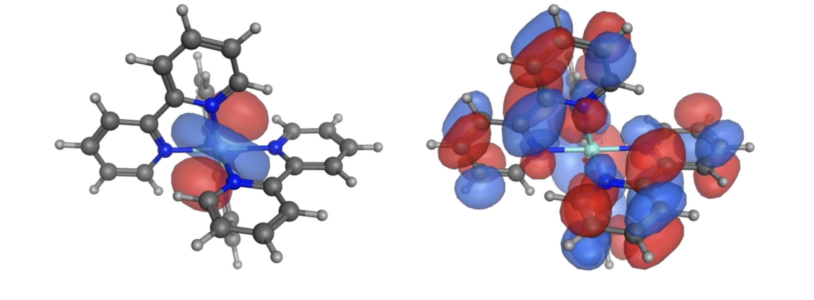

# Workshop Questions for Week 3 {#ch:Workshop2}

## Questions {#sec:fluorescencequestions}

### Short mathematical question - Quantum Yield and lifetime {#sec:YieldLifetime}
The quantum yield and lifetime of a dye were measured to be 0.43 & 2.6 ns respectively. What is the natural lifetime?

*(I will use MCQs and UniDoodle to ask this in class)*

You can find the answer to this question in \@ref(sec:YieldLifetimeans)

### Short conceptual question - Effect of other processes {#sec:otherprocesses}

For a given value of τ~0~ what happens to the lifetime and quantum yield as k~IC~ and k~ISC~ increases?


*(This will be a discussion question)*

You can find the answer to this question in \@ref(sec:otherprocessesans)

### Conceptual question - Effect of structure {#sec:structure}
Fluorescein (figure \@ref(fig:fluorescein)) in basic aqueous solution has a quantum yield of fluorescence, Φ~f~, of 0.95, and fluorescence lifetime, τ~f~, of 4.1 ns.

```{r echo=FALSE, fluorescein, out.width='70%', fig.show='hold', fig.align='center', fig.cap='The structure of the fluorescent molecule fluorescein'}
knitr::include_graphics("images/fluorescein.png")
```

*(This will be a discussion question)*

You can find the answer to this question in \@ref(sec:structureans)

### Conceptual question - lack of symmetry in spectra {#sec:symmetryspec}

The absorption and emission spectrum of fluorescein is shown in figure (\@ref(fig:fluoresceinspec))

```{r echo=FALSE, fluoresceinspec, out.width='70%', fig.show='hold', fig.align='center', fig.cap='The absorption (solid) and emission (dashed) spectrum of fluorescein in basic ethanol.'}
knitr::include_graphics("images/fluoresceinspec.png")
```

Why are the absorption bands between 200 – 350 nm not reflected in the emission spectrum?

You can find the answer to this question in \@ref(sec:symmetryspecans)

### Conceptual question - Stokes' shift {#sec:stokes}


The inorganic dye [Ru(bpy)~3~]^2+^ has a measured lifetime in water of 580 ns and a natural lifetime of 13.8 µs. The spectrum is shown in figure \@ref(fig:Rubpyspec). What is the origin of the large Stokes' shift in this system?

```{r echo=FALSE, Rubpyspec, out.width='70%', fig.show='hold', fig.align='center', fig.cap='The absorption (black) and emission (red) spectrum of ruthenium tris bypyridine in water.'}
knitr::include_graphics("images/Rubpy3spectra.png")
```

Data from Shi *et al.*, Synthesis and characterization of phosphorescent two coordinate copper(I) complexes bearing diamidocarbene ligands. [Dalton Trans., 2017,46, 745-752.](https://doi.org/10.1039/C6DT04016K)

You can find the answer to this question in \@ref(sec:stokesans)


### Conceptual question - the effect of binding on emission {#sec:binding}

The asymmetric cyanine dye YO-Pro-1 is a DNA stain because it has a large increase on fluorescence emission when binding to DNA. The lifetime in free solution is around 2 ps and when bound to DNA is 2.4 ns. What is the structural origin of the large increase of emission upon binding?

```{r echo=FALSE, YODNA, out.width='70%', fig.show='hold', fig.align='center', fig.cap='The emission spectrum of the choromophore YO-Pro-1 when free in aqueous solution (blue) and when bound to DNA (pink)'}
knitr::include_graphics("images/YODNA.png")
```

*(This will be a discussion question)*

You can find the answer to this question in \@ref(sec:bindingans)

### Extended question - Properties of Ethidium Bromide (Example Exam Question) {#sec:examethidium}

Ethidium bromide (EB, figure \@ref(fig:ethidiumstructure) is used as a DNA stain, which is essentially non-fluorescent in aqueous solution, but shows a strong enhancement of emission upon binding to double stranded DNA (which has a negatively charged backbone).

Emission is almost exclusively from the singlet excited state, but a triplet state has been shown to exist, which emits with a low quantum yield (Φ~P~ = 0.00006).

```{r echo=FALSE, ethidiumstructure, out.width='30%', fig.show='hold', fig.align='center', fig.cap='The structure of the cationic ethidium bromide chromophore.'}
knitr::include_graphics("images/ethidiumstructure.png")
```

- Sketch a Jablonski diagram for the processes you know to occur.

- The molar extinction coefficient, ε, of EB has be measured to be 78500 M^−1^ cm^−1^. What factors contribute to EB having such a high extinction coefficient?

The following spectra, lifetimes and quantum yield have been measured for EB in different free solution and DNA systems:

Table: (\#tab:ethidiumlifetime) The lifetimes and quantum yields of ethidium bromide in aquous solution and when bound to DNA in protiated and deuterated systems.

| | τ / ns | Φ~f~ |
|:--------------|:---------|:---------|
| H~2~O (no DNA) | 1.6 | 0.012 |
| D~2~O (no DNA)  | 6.3 |  |
| DNA | 28.3 | 0.220 |
| DNA (deuterated) | 38.4 | |


```{r echo=FALSE, ethidiumspectra, out.width='30%', fig.show='hold', fig.align='center', fig.cap='The absorption (black) and emission (pink) spectrum of ethidium bromide when bound to DNA.'}
knitr::include_graphics("images/ethidiumspectra.png")
```

- What factors likely lead to an enhancement of fluorescence quantum yield upon binding to DNA?

- Show that the natural lifetime of EB is 129 ns.

- What is the origin of the large Stoke’s shift (λ~max ex~ = 520 nm, λ~max em~ = 608 nm)

- What transitions are responsible for the absorption features in the:
      * 400-600 nm range
      * 200-350 nm range

- Why are the features in the 200-350 nm range not replicated in the emission spectrum?

- Why does deuterating the solvent (or DNA) effect the lifetime of the excited state?

- What effect would freezing the samples have on the lifetime, fluorescence quantum yield & phosphorescence quantum yield.

A study of the thermodynamics of the dye DNA system measured the binding constant of EB with DNA to be 1.05 × 10^6^.

- Why is the measured quantum yield for a system containing 2 µM EB and 20 mM DNA only 0.18?

- Why would increasing the ionic strength of the solution, increase the fluorescence intensity of EB in solution with DNA?  

You can find the answer to this question in \@ref(sec:examethidiumans)


## Answers {#sec:fluorescenceanswers}

### Short mathematical question - Quantum Yield and lifetime {#sec:YieldLifetimeans}

The fluorescence quantum yield (equation \@ref(eq:lifetimefluor) and fluorescence lifetime (equation \@ref(eq:lifetimefluor)) are related to the rate constants for the different decay processes.

\begin{equation}
\phi_f = \frac{k_f^0}{k_f^0+k_{ic}+ k_{ST}+k_{\textrm{other}}}
(\#eq:QYfluor)
\end{equation}

\begin{equation}
\tau_f = \frac{1}{k_f^0+k_{ic}+ k_{ST}+k_{\textrm{other}}}
(\#eq:lifetimefluor)
\end{equation}

The natural lifetime is the lifetime when the only decay pathway is fluorescence emission (equation \@ref(eq:natural)). 

\begin{equation}
\tau_f^0 = \frac{1}{k_f^0}
(\#eq:natural)
\end{equation}

Combining equations  \@ref(eq:QYfluor) and \@ref(eq:lifetimefluor):

\begin{equation*}
\frac{\tau_f}{\phi_f}=\frac{\frac{1}{k_f^0+k_{ic}+ k_{ST}+k_{\textrm{other}}}}{\frac{k_f^0}{k_f^0+k_{ic}+ k_{ST}+k_{\textrm{other}}}}=\frac{1}{k_f^0}=\tau_f^0
\end{equation*}

Consequently $\tau_f^0 = \frac{\tau_f}{\phi_f}=\frac{2.6}{0.43}= 6.0$ ns

### Short conceptual question - Effect of other processes {#sec:otherprocessesans}

If $k_f^0$ is fixed (which it is for a given chromophore) then as we adjust the other rate constants in equation \@ref(eq:lifetimefluor) the emission lifetime (the time it takes for the intensity to reduce to 1/e of the initial intensity) decreases, as shown in figure \@ref(fig:rateslifetime).

```{r echo=FALSE, rateslifetime, out.width='70%', fig.show='hold', fig.align='center', fig.cap='The variation of the emission lifetime (the time it takes to decay to 1/e of the initial concentration, for a constant rate of fluorescence emission but increasing rates of non-radiative decay.'}
knitr::include_graphics("images/rateslifetime.png")
```


### Conceptual question - Effect of structure {#sec:structureans}

The only things that affect the quantum yield and lifetime (equations \@ref(eq:lifetimefluor) and \@ref(eq:lifetimefluor)) are the different rate constants involved. The quantum yield is a measure of the proportion of excited states which decay by each pathway.

Therefore if the quantum yield of fluorescence is near unity then neither the rate of intersystem crossing or internal conversion is large. Intersystem crossing may occur due to the change in orbital type offered, but given the lack of heavy atoms this rate is unlikely to be high and will probably be a negligable proprortion given the high rates of other processes.

The rate of intersystem crossing is more efficient for rotations than vibrations (due to the closwer spacing of rotational energy levels), therefore if rotations can occur the rate of internal conversion tends to be quite high. In this case there is only one likely bond that could rotate to loose the excited state of the system. This is the single bond linking the two ring systems. Rotation around this bond is severly inhibited though due to the presence of the acid group which restricts rotation.

Please note that it is rotations around bonds that cross the conjugation within the molecule that allow for the most efficient energy loss.

### Conceptual question - lack of symmetry in spectra {#sec:symmetryspecans}

Kasha's rule states *"An excited state always emits from the lowest energy level of that spin multiplicity state.* Consequently we can excite into any available orbital, but the excited state will rapidly decay into the lowest energy level of that multiplicity. So although we are exciting from S~0~ into S~1~, S~2~, S~3~... any excited state will rapidly decay by internal conversion down to the S~1~ excited state and all emission will occur from this state.

Kasha's rule is a consequence of the energy gap law which I alluded to when talking about the special case of azulene, but this will be covered in a video specifically talking about the energy gap law.


### Conceptual question - Stokes' shift {#sec:stokesans}

Firstly we need to separate two things - the first is just the origin of the Stokes' shift due to the transition of an electron occuring very quickly leaving an optimised state to occupy an unoptimised state, which later relaxes. A typical Stokes' shift is ~20 nm, the Stokes' shift in this example is more than 150 nm... why?

If we consider the system that we have at hand, in this case [Ru(bpy)~3~]^2+^ we can note the HOMO-LUMO transition is an MLCT. This has a large difference in structure of the HOMO & LUMO with a redistribution of charge which will also have a large effect on the arrangement of the solvent shell. Given this large difference in optimised structure there would be a large shift.


```{r echo=FALSE, RubpyMLCT, out.width='70%', fig.show='hold', fig.align='center', fig.cap='The HOMO (left) and LUMO (right) of ruthenium (II) tris bipyridine clearly showing the MLCT nature of the transition.'}

```

However this isn't the only factor, the natural lifetime of 13.8 µs would indicate that the emission transition is phosphorescence, this spin forbidden transition has electrons alligned in parallel which is lower than the corresponding singlet state. So after excitation there is a change in multiplicity of the excited state, this lowers the energy of the system further moving the $\lambda _{max}$ of emission to lower energy (longer wavelength).

<span style="color: darkcyan;"> Data from Shi *et al.*, Synthesis and characterization of phosphorescent two coordinate copper(I) complexes bearing diamidocarbene ligands. [Dalton Trans., 2017,46, 745-752.](https://doi.org/10.1039/C6DT04016K)


### Conceptual question - the effect of binding on emission {#sec:bindingans}

The chromophore YO-Pro-1 has a methine bridge between the two halves of the chromophore, this offers efficient loss of the excited state *via* internal conversion (see question \@ref(sec:structure). As noted earlier free rotation around a bond which cuts across the conjugation is particularly efficient in deactivating an excited state.

If this pathway is inhibited by binding to the DNA (the dye intercalates between the base pairs but any dye DNA interaction would inhibit this mechanism of excited state decay) then the fluorescence lifetime will increase (equation \@ref(eq:lifetimefluor)).

### Short conceptual question - effect of polar solvents on emission {#sec:polarsolvans}

### Extended question - Properties of Ethidium Bromide (Example Exam Question) {#sec:examethidiumans}

```{r echo=FALSE, Jablonski2, out.width='60%', fig.show='hold', fig.align='center', fig.cap='A Jablonski diagram indicating the allowed transitions within the system, absorbance , internal conversion, intersystem crossing, fluorescence and phosphorescecne.'}
knitr::include_graphics("images/Jablonski.png")
```

If phosphorescecne occurs there must be some intersystem crossing in both directions.

***


There is a rigid structure indicating a similar ground and excited state strucutre, which would lead to a good overlap integrals between the HOMO and LUMO. THe molar extinction coefficient is a measure of this overlap integral.

***

The chromophore single bond between the two halves of the chromophore, this offers efficient loss of the excited state *via* internal conversion (see question \@ref(sec:structure). As noted earlier free rotation around a bond which cuts across the conjugation is particularly efficient in deactivating an excited state.

If this pathway is inhibited by binding to the DNA (the dye intercalates between the base pairs but any dye DNA interaction would inhibit this mechanism of excited state decay) then the fluorescence lifetime will increase (equation \@ref(eq:lifetimefluor)).

***

\begin{equation*}
\phi_f = \frac{k_f^0}{k_f^0+k_{ic}+ k_{ST}+k_{\textrm{other}}}
\end{equation*}

\begin{equation*}
\tau_f = \frac{1}{k_f^0+k_{ic}+ k_{ST}+k_{\textrm{other}}}
\end{equation*}

The natural lifetime is the lifetime when the only decay pathway is fluorescence emission (equation \@ref(eq:natural)). 

\begin{equation*}
\tau_f^0 = \frac{1}{k_f^0}
\end{equation*}

Combining equations  \@ref(eq:lifetimefluor) and \@ref(eq:lifetimefluor):

\begin{equation*}
\frac{\tau_f}{\phi_f}=\frac{\frac{1}{k_f^0+k_{ic}+ k_{ST}+k_{\textrm{other}}}}{\frac{k_f^0}{k_f^0+k_{ic}+ k_{ST}+k_{\textrm{other}}}}=\frac{1}{k_f^0}=\tau_f^0
\end{equation*}

Consequently $\tau_f^0 = \frac{\tau_f}{\phi_f}=\frac{1.6}{0.012}= 129$ ns

***

We are told the transition is fluorescence, but it has a very long natural lifetime. This long lifetime would indicate that despite the transition being selection rule allowed there is a structural explanation for the inefficiency of this process.

This would indicate that there is now a poor overlap integral indcating a poor overlap of the excited state and ground state structures, or there is a large difference in the structures of the excited and ground states.

This large difference in structure would be accounted for in the Stokes' shift - a large deviation in structure would lead to a larger energy loss upon the optimisation of the excited state.

***


The molecule has hetero atoms and so there will be both $n-\pi*$ and $\pi-\pi*$ transitions, the $n-\pi*$ transitions will occur at lower energy (higher wavelength) and be the HOMO-LUMO transition.

***

Kasha's rule states *An excited state always emits from the lowest energy level of that spin multiplicity state.* Consequently we can excite into any available orbital, but the excited state will rapidly decay into the lowest energy level of that multiplicity. So although we are exciting from S~0~ into S~1~, S~2~, S~3~... any excited state will rapidly decay by internal conversion down to the S~1~ excited state and all emission will occur from this state.

***

Ultimately because it affects the rates of internal conversion, and so the lifetime is changed as described in equation @\ref(eq:lifetimefluor). We will learn more as to why when we cover the energy gap law.

***

You would expect the emission lifetime and quantum yield to increase on freezing (as described in equation @\ref(eq:lifetimefluor)) as the efficiency (and therefore rate) of internal conversion mechanisms (particularly rotational relaxation) would be dramatically reduced in solid systems.

***

This will be due to there being two states - one where the chromophore is bound, one where it is not. It is an equilibrium so not all dye will be bound to DNA. When not bound there is no fluorescence enhancement. The quantum yield we see is in fact a weighted average between the two states.

This is a problem solving question and any reasonable attempt would have been given credit. It is demonstrating an ability to think about data and the problem in a scientific manner.

***

This would push the equilibrium to form the dye:DNA complex increasing binding, as the binding increases the proportion of molecules displaying the higher quantum yield increases and the overall emission intensity of the sample increases.

This is a problem solving question and any reasonable attempt would have been given credit. It is demonstrating an ability to think about data and the problem in a scientific manner.

