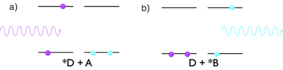
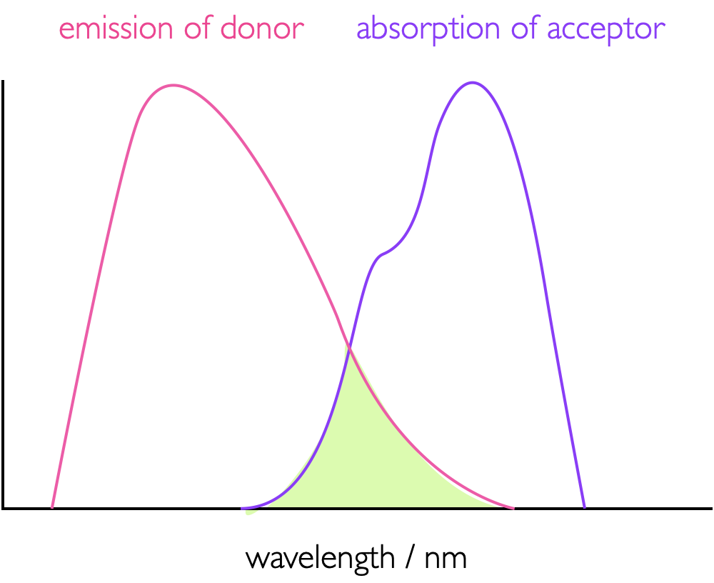
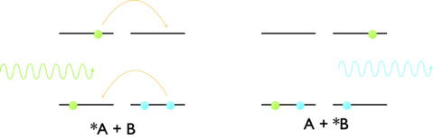
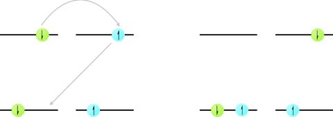

# Non-emmisive Deactivation of the Excited State {#ch:Quench}

### Learning Objectives {#sec:QuenchLOs}

At the end of this section you should be able to:

- Discuss the heavy atom effect.
- Understand the difference between static and dynamic quenching.
- Graphically determine quenching constants for static, dynamic and mixed method quenching.
- Describe mathematically the effect of quenching on emission quantum yields and lifetime.
- Describe the mechanisms of non-collisional energy transfer.
- Demonstrate understanding of the factors which affect the rates of non-collisional energy transfer.

## The Energy Gap Law {#sec:energygap}

The natural lifetime of fluorescence assumes that there is no other available pathway for deactivation of the excited state. However, the effects of internal conversion and intersystem crossing have already been seen by the presence of rate constants for internal conversion (IC) and intersystem crossing (ST) in the equations for quantum yield of fluorescence. The rate of non-radiative decay is given by the energy gap law (a formalised equation is not given here) which depends upon a number of factors but principally the energy gaps (ΔE) between electronic levels.

Non radiative decay become increasingly unfavourable as the energy gaps become bigger, and the rate of non-radiative decay decreases exponentially with increasing energy gaps. The energy gaps between higher electronic states (S~2~, S~3~, S~4~ *etc.*) are usually significantly smaller than the S~1~ - S~0~ energy gap leading to rapid internal conversion down to the lowest (singlet) excited state, which is the origin of Kasha’s rule.

Table: (\#tab:actinometer) The lifetime of the excited state increases dramatically as the energy gap between the ground and excited state increases due to a decrease in internal conversion. The quantum yield of emission increases as the rate constant for internal conversion decreases..

| | λ~abs~ / nm | λ~em~ / nm | ΔE / eV | τ/ nw | Φ~em~ |
|:----------------|:----|:----|:----|:----|:----|
| [Os(phen)~3~]^2+^ | 650 | 720 | 0.186 | 260 | 0.016 |
| [Os(phen)~2~(dppene)]^2+^ | 455 | 609 | 0.69 | 1830 | 0.138 |
| [Os(phen)(dppene)~2~]^2+^ | 400 | 530 | 0.761 | 3600 | 0.518 |

The rate of non-radiative decay also depends upon the vibrations within a molecule (this should be logical since the energy is lost as heat), as well as the size of any structural changes required upon deactivation of the excited state. Since the frequency of vibrations is a factor in the rate of non-radiative decay there are clear isotope effects; particularly when hydrogens are replaced with deuteriums. C-H stretches occur with a frequency around 3000 cm^−1^, whereas this is much lower at around 2200 cm^−1^ for C-D stretches; because of this the efficiency of vibrational relaxation in the hydrogen sample is considerably greater and the lifetime of the excited state is consequently longer in the deuterated sample.

Now a quantitive value may be determined for the rate of internal conversion it is easy to quantify the rate of intersystem crossing.

For intersystem crossing the efficiency is again determined by the size of the energy gap between the singlet and triplet states.

El Sayed’s rule states:

>the rate of intersystem crossing is relatively large if the radiationless transition involves a change in the orbital type.*

Consequently intersystem crossing is considerably more efficient in molecules where there are hetero atoms as can be seen when comparing the rates of singlet triplet intersystem crossing between anthracene and 9-acetoanthracene, figure \@ref(tab:rateST). However, the presence of a hetero atom does not guarantee a high rate of intersystem crossing, for systems where there is no change in orbital type there rate constants are in the order of 100 to 1000 times more slow than those with a change in orbital type.

Table: (\#tab:rateST) The rates of intersystem crossing for a range of organic chromophores illustrating El Sayed’s rule. When orbitals are listed as (for example) π,π* then it is looking at the pair of electrons in the highest orbitals (the valence HOMO electrons in the ground state), upon excitation an electron is excited from the π to the π* orbital.

| | transition | transition type  | k~ST~ / s^−1^ |
|:--------|:--------|:------|:------|
| anthracene | S~1~ (π,π\*) ⟶ T~1~ (π,π*) | forbidden | 1.4 × 10^8^ |
| acetone | S~1~ (n,π\*) ⟶ T~1~ (n,π*) | forbidden | 5 × 10^8^ | 
|benzil |  S~1~ (n,π\*) ⟶ T~1~ (n,π*) | forbidden | 5 × 10^8^|
| biacetyl |  S~1~ (n,π\*) ⟶ T~1~ (n,π*) | forbidden |  7 × 10^7^ |
| 9-acetoanthracence | S~1~ (π,π\*) ⟶ T~1~ (n,π*) | allowed | ~10^10^ |
| benzophenone | S~1~ (π,π\*) ⟶ T~1~ (n,π*) | allowed | ~10^11^ |


## Collisional Deactivation of the Excited State {#sec:Collisional}

The photophysical deactivation pathways described above (emission, internal conversion and intersystem crossing) are not the only ways to deactivate an excited state of a molecule, and you perhaps have already noted the use of kother in equations \@ref(eq:QYfluor) - \@ref(eq:QYphos). Another common pathway of deactivation, particularly in the solution phase, is collisional deactivation commonly known as quenching.

Table \@ref(tab:phototrans), part of which is repeated below, details all of the possible decay pathways from an excited state. Quenching competes with other processes, and consequently reduces the lifetime and yield of emission processes.

| |  |
|:--------------|:---------|
|*Other pathways*| |
Quenching of excited state |  $S_1 + Q \longrightarrow S_0 + Q +heat$ <br> $S_1 + Q \longrightarrow S_0 + Q^\ast +heat$ <br> $T_1 + Q \longrightarrow S_0 + Q +heat$ <br> $T_1 + Q \longrightarrow S_0 + Q^\ast +heat$ |

Quenching of the excited state competes with emission from the excited state, consequently reducing the quantum yield of fluorescence (or phosphorescence). 

This bi-molecular, second order quenching process follows Stern-Volmer kinetics, equation \@ref(eq:SternVolmer), a derivation of which can be found in Wardle, p 88-90).


\begin{equation}
\frac{I_0}{I}=1 + k_q \tau _0 [Q]
(\#eq:SternVolmer)
\end{equation}

Where $I_0 / I$ is the ratio of the unquenched and quenched steady state intensity of the emission. For dynamic quenching this value will also be the same as $\phi _0 / \phi$ and $\tau _0 / \tau$, the ratios of the quantum yield and lifetime respectively, equation \@ref(eq:SternVolmerdynamic).

\begin{equation}
\frac{I_0}{I}=\frac{\phi_0}{\phi}=\frac{\tau_0}{\tau}=1 + k_q \tau _0 [Q]
(\#eq:SternVolmerdynamic)
\end{equation}

Since this is a second order term when it appears in the equations \@ref(eq:QYfluor) - \@ref(eq:QYphos), it appears as $k_q[Q]$, such as indicated in equation \@ref(eq:QYfluorquench).

\begin{equation}
\phi_f = \frac{k_f^0}{k_f^0+k_{ic}+ k_{ST}+k_q[Q]}
(\#eq:QYfluorquench)
\end{equation}

It is often useful to know if the quenching is diffusion or activation controlled, reactions in the solution phase cannot occur faster than the diffusion controlled rate, with second order rate constant $k_d$, as described in equation 19.

\begin{equation}
k_d = \frac{8RT}{3 \eta}
(\#eq:diffcontrol)
\end{equation}

where T is the absolute temperature, and η the viscosity of the solvent. (It should be noted that there is an issue with units here where a conversion from m^3^ to dm^3^ is required). Diffusion controlled rates in aqueous, methanol and ethanol solutions are normally in the order of 10^10^ mol^−1^ dm^3^. Values of rate constant lower than this are termed as activation controlled as only a fraction of the collisions result in a quenching of the excited state of the molecule.

## Static Quenching {#sec:static}

Dynamic quenching effects the lifetime of the excited state, as described in equation \@ref(eq:SternVolmerdynamic). However this is not the case for static quenching; in static quenching an equilibrium exists between dye bound to the quencher and unbound dye and quencher as described below, with equilibrium constant $K_q$.

\begin{equation*}
\textrm{dye}^\ast \textrm{ + quencher} \rightleftharpoons \textrm{dye:quencher}^\ast
\end{equation*}

\begin{equation*}
K_q = \frac{[\textrm{dye:quencher}]}{[\textrm{dye}][\textrm{quencher}]} 
\end{equation*}

In this case free dye is emissive with an unquenched lifetime, and dye that exists in complex with the quencher is completely non-emissive. Static quenching follows a very similar form to Stern-Volmer as described above, and again a full derivation may be found in Wardle.

\begin{equation}
\frac{I_0}{I}=1 + K_s [Q]
(\#eq:SternVolmerstatic)
\end{equation}

As with dynamic quenching the change in steady state emission is reflected in the change in quantum yield of fluorescence, but this time because the dye exists in either a quenched ( completely non fluorescent) or unquenched (fluorescent) state then the fluorescent lifetime is unchanged in static quenching.

In some cases a quencher can act as both a static and dynamic quencher; in this case the lifetime is only affected from the dynamic quenching and so the rate constant may easily be determined, from knowing this it is simple to determine the equilibrium constant. Systems where there is a combination of static and dynamic quenching are easy to spot as plots of $I_0 / I$ against the $[Q]$ are curved.

<div style="text-align: center;"><iframe width="480" height="360" src="https://www.youtube.com/embed/MzS3jKsoDZo" frameborder="0" allow="accelerometer; autoplay; encrypted-media; gyroscope; picture-in-picture" allowfullscreen></iframe></div>

## Förster Resonance Energy Transfer {#sec:forster}

In addition to static and dynamic quenching, as described above, where the excited state of the dye molecule is lost as heat, it is possible for a dye to be quenched by transferring the energy between two chromophores. There are two distinct mechanisms for this happening the first of which is described here; Förster Resonance Energy Transfer (FRET).

```{r echo=FALSE, forster, out.width='70%', fig.show='hold', fig.align='center', fig.cap='The mechanism of Förster resonance energy transfer. a) A donor molecule (purple) is excited by absorption of a photon into an excited state, there is a dipole dipole interaction with the acceptor molecule (blue) which is initially in the ground state. b) the product of energy transfer with the acceptor now in an excited state which is now capable of emission of a photon of lower energy.'}

```

The first thing to note is that FRET is not a collisional process, energy is transferred between a donor and acceptor moiety at a distance, nor is this an emission of a photon by the donor and reabsorption of this photon by the acceptor.

FRET is a dipole dipole interaction where the acceptor quenches the excited state of the donor by energy transfer between the two moieties, figure \@ref(fig:forster), leaving the donor in an excited state which then decays as described in the a chapter on emission. This dipole-dipole interaction is a co-alligning of the transition dipole moments (see page Section \@ref(#sec:transdipole) on the donor and acceptor molecules - this gives a large dependence on the orientation factors of these two dipoles, the term κ in equation \@ref(eq:rateelectron). In order for there to be an energy transfer there has to be an overlap between the emission spectra of the donor and the absorption spectra of the acceptor (equation \@ref(eq:overlap)), the greater, as illustrated in figure \@ref(fig:overlapintegral); this is in effect the overlap between the wave function of the excited state donor and the wave function of the ground state donor. The greater this overlap the more efficient the the energy transfer.

```{r echo=FALSE, overlapintegral, out.width='70%', fig.show='hold', fig.align='center', fig.cap='The overlap integral, J, (green shaded area) between the emission spectrum of a donor and absorption spectrum of an acceptor as used in FRET, the greater this overlap integral more more efficient the energy transfer.'}

```

\begin{equation}
J (\bar \nu) = \int_0^\infty I_D(\bar \nu)\varepsilon_A(\bar \nu)\textrm{d}\bar \nu
(\#eq:overlap)
\end{equation}

The rate of Förster resonance energy transfer has been found empirically to depend upon a number of factors in addition to the overlap integral, $J$, such as refractive index of the solvent, $n$, and the dipole orientation factor $\kappa$ (equation \@ref(eq:rateelectron)). Perhaps more obviously it also depends upon the separation of donor and acceptor, $r$, quantum yield of emission of the donor, $\phi_D$, and the unquenched lifetime of the donor molecule, $\tau_D$.

\begin{equation}
k_{ET}= \frac{\phi_D \kappa^2}{\tau_D r^6}\frac{9 \ln 10 e^4}{128 \pi^5 N_A n^4}J
(\#eq:rateelectron)
\end{equation}

However, equation \@ref(eq:rateelectron), is not simple to use, nor particularly descriptive and a simplified version of the equation tends to be used which has defined a ‘Förster radius’, $R_0$, equations 23 & 24. The Förster radius is the radius at which half of the emission is quenched by the acceptor.

\begin{equation}
R_0^6=\frac{9 \ln 10 e^4 \phi_D \kappa^2}{128 \pi^5 N_A n^4 }J
(\#eq:forsterdistance)
\end{equation}

\begin{equation}
k_{ET}=\frac{1}{\tau_D}\frac{R_0^6}{r^6}
(\#eq:forstersimplified)
\end{equation}

Förster distances tend to be between 20 - 90 Å, and due to the parity of this with the size of biological macromolecules FRET is an excellent technique for studying biomolecules. 
The quantum yield of Förster energy transfer, $Φ_{ET}$ (equation \@ref(eq:QYET)), is usually just given the symbol $E$, for efficiency. As described in equations \@ref(eq:rateelectron) - \@ref(eq:forstersimplified) this can be defined by:

\begin{equation}
\phi_ET = \frac{k_ET}{k_f^0+k_{ic}+ k_{ST}+k_{ET}}
(\#eq:QYET)
\end{equation}

By combining equations \@ref(eq:forstersimplified) & \@ref(eq:QYET) it becomes easy to see how the efficiency of Förster energy transfer ($E$ or $Φ_{ET}$) depends upon the distance, and we can see that the efficiency of energy transfer is 0.5 at the Förster distance. Figure \@ref(fig:forsterdistance) sketches the distance dependence of efficiency of energy transfer, where it can be seen that at twice the Förster distance the efficiency has dropped almost to 0.

```{r echo=FALSE, forsterdistance, out.width='70%', fig.show='hold', fig.align='center', fig.cap='The distance dependence on the efficiency of energy transfer between a donor and acceptor in Förster resonance energy transfer (pink line), the purple line represents the distance dependence variation in the measured lifetime of the donor molecule with a maximum value of the unquenched donor of τ~D~..'}
knitr::include_graphics("images/forsterdistance.png")
```

\begin{equation}
E=1-\frac{\tau_{DA}}{\tau_D}
(\#eq:efflifetime)
\end{equation}

\begin{equation}
E = \frac{R_0^6}{R_0^6+ r^6}
(\#eq:effdistance)
\end{equation}

The efficiency of energy transfer is calculated by measuring the quenched and unquenched fluorescence lifetime of the donor molecule. More detailed derivations of equations \@ref(eq:efflifetime) & \@ref(eq:effdistance) may be found in Turro, Principles of Molecular Photochemistry.

Experimentally the process is confirmed to energy transfer at a distance, and not collisional energy transfer, as the rate constant of energy transfer $k_{ET}$ is  independent of solvent viscosity (as seen in equation \@ref(eq:diffcontrol) & Stern-Volmer kinetics) and rates can be significantly higher than the rate limiting diffusion controlled rates. The energy is transferred by a dipole-dipole interaction.

## Dexter Energy Transfer {#sec:Dexter}

Forster resonance energy transfer transfers energy between a donor an acceptor moiety by a dipole dipole interaction, however there is a second method of energy transfer which takes place by a slightly different mechanism. Dexter energy transfer transfers energy from a donor to acceptor moiety by a concerted exchange of electrons between the chromophores, figure \@ref(fig:Dexter).


```{r echo=FALSE, Dexter, out.width='70%', fig.show='hold', fig.align='center', fig.cap=' The mechanism of Dexter energy transfer, where there is a concerted exchange of electrons from the LUMO of the donor to the empty LUMO of the acceptor and at the same time from the HOMO of the acceptor to the HOMO of donor. The two electrons move at the same time leading to a net exchange of energy from the donor to acceptor.'}

```


The rate of Dexter energy transfer is again distance dependent and again is dependent upon the overlap integral, J, between the emission of the donor and the absorption of the acceptor (figure \@ref(fig:overlapintegral), equation \@ref(eq:overlap)). The rate of Dexter energy transfer is given by:

\begin{equation}
k_{ET}=KJe^{-\frac{2r}{L}}
(\#eq:ratedexter)
\end{equation}

where $J$ is the overlap integral, $K$ an empirical constant, $r$ the separation between the donor and acceptor, and $L$ another constant which represents the closest possible separation of the donor and acceptor (the sum of the van der Waals radii of the two chromophores).

From examining equation \@ref(eq:ratedexter) it can be seen that the rate of Dexter energy transfer decreases rapidly with increasing separation of donor and acceptor and occurs daily at distances less than 20 Å. Dexter energy transfer is the most dominant mechanism of triplet-triplet quenching.

## Triplet-Triplet Annihilation {#sec:tripletannihilation}

Excited state triplets are long lived, due to the spin-forbidden relaxation pathways back to the $S_0$ state. However, there is a deactivation pathway that occurs by annihilation of two triplet states leading to formation of an excited state singlet and a ground state singlet.


```{r echo=FALSE, triplettriplet, out.width='70%', fig.show='hold', fig.align='center', fig.cap='The mechanism of triplet triplet annihilation by Dexter energy transfer, concerted electron exchange between a donor and acceptor molecule leading to formation of a singlet excited state on one molecule and a ground state singlet on the other molecule.'}

```

\begin{equation*}
^\ast D_{T_1}+^\ast D_{T_1} \longrightarrow ^\ast D_{S_1} + D_{S_0}
\end{equation*}

Triplet-triplet annihilation is the reason that quantum yields of phosphorescence are almost never unity (1).

## Quenching by Molecular Oxygen {#sec:O2quench}

```{r echo=FALSE, O2, out.width='70%', fig.show='hold', fig.align='center', fig.cap='a) The valence set of molecular orbitals in molecular oxygen, showing the full electronic arrangement for the 3Σg− triplet ground state.  b) The π* HOMO orbital of molecular oxygen, with the 3Σg− triplet ground state and the singlet excited states 1Δg and 1Σg+.The relative energies of the two excited states are indicated.'}
knitr::include_graphics("images/O2.png")
```

Molecular oxygen is unusual because it is a ground state triplet. It is an efficient quencher of excited triplet states because it has two accessible excited singlet states, figure \@ref(fig:O2). It is also capable of quenching excited singlet states, however since the quenching occurs by a Dexter mechanism the overlap integral between excited singlet states and ground state molecular oxygen tends to be very small leading to very small quantum yields of singlet oxygen formation.

\begin{equation}
\textrm{O}_2(^3 \Sigma _g^-)+ ^\ast \textrm{Dye}(T_1) \longrightarrow ^\ast \textrm{O}_2(^1 \Delta _g) + \textrm{Dye}(S_0)
(#eq:O2quench)
\end{equation}

Usually the molecular oxygen is excited into the ^^Σ~g~^+^ state, but this rapidly decays to the ^1^Δ~g~ state. The ^1^Δ~g~ is usually simply referred to as singlet oxygen and is relatively stable because of the spin forbidden deactivation, having a lifetime of a few µs in aqueous solvent and hours in the gas phase. 

Chemically singlet oxygen formation is very interesting as it is extremely reactive, and has been shown to be an important factor in a number of mechanistic pathways leading to damage of DNA and proteins.

<div style="text-align: center;"><iframe width="480" height="360" src="https://www.youtube.com/embed/2z6sm2G5GS0" frameborder="0" allow="accelerometer; autoplay; encrypted-media; gyroscope; picture-in-picture" allowfullscreen></iframe></div>

## Before Completing this Section

To support the material in this section it is suggested you read chapter 6 of Wardle ‘Principles and Application of Photochemistry’.

