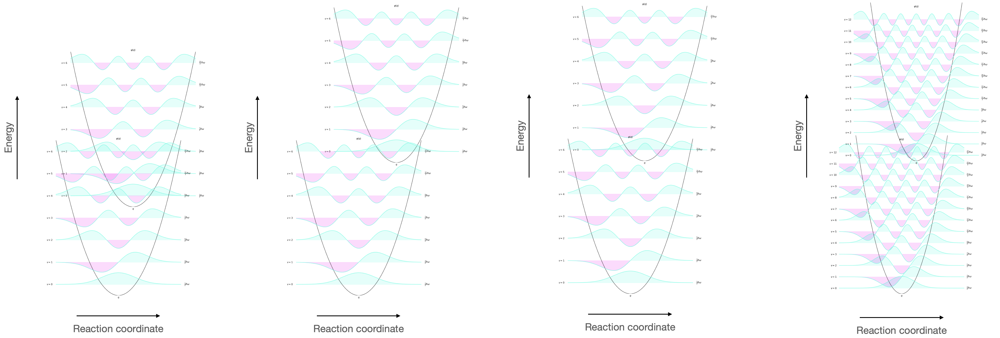

# Workshop Questions for Week 4 {#ch:Workshop3}

## Questions

### Short conceptual question - Electronic-vibrational overlap integrals {#sec:overlap}

```{r echo=FALSE, overlap, out.width='70%', fig.show='hold', fig.align='center', fig.cap='The grond and excited state potential wells and the vibrational levels within them.'}
knitr::include_graphics("images/overlap.png")
```

On the figure sketch the vibrational energy levels in the ground and the excited state.

How would the following affect this overlap integral?
1. Energy gap.
1. The vibrational energy gaps
1. Reaction coordinate (the difference in structure between ground and excited state)

*(I will use drawing in UniDoodle to ask this in class, with the second part being a discussion question)*

## Short conceptual question - The effect of structural changes on quantum yield {#sec:structureQY}

5,10-dihydroindeno[2,1-a]indene and trans-stilbene (figure \@ref(fig:stilbeneindene)) are similar in structure but have very different fluorescent quantum yields of 1.00 and 0.05 respectively, however for trans-stilbene this increases to 0.75 at 77 K. Suggest a reason for the difference in quantum yield of:
    - the two molecules
    - the two temperatures
    
```{r echo=FALSE, stilbeneindene, out.width='60%', fig.show='hold', fig.align='center', fig.cap='5,10-dihydroindeno[2,1-a]indene (left) and trans-stilbene (right)'}
knitr::include_graphics("Images/stilbeneindene.png")
```    

*(This will be a discussion question)*

### Short mathematical question - Effect of the rate of singlet triplet intersystem crossing on th quantum yield of phosphorescence {#sec:ratephos}

Why is it likely that the quantum yield of phosphorescence of a sample would increase after the sample is frozen.

*(This will be a discussion question)*

### Short mathematical question - Determining the quantum yield of phosphorescence {#sec:calcphos}

A molecule decays by a combination of internal conversion, intersystem crossing and phosphorescence. What is the quantum yield of phosphorescence?

- k~IC~ = 2.1 × 10^11^ s^−1^
- k~ST~ = 2.9 × 10^9^ s^−1^
- k~TS~ = 7.4 × 10^6^ s^−1^
- k~p~^o^ = 6.2 × 10^8^ s^−1^

*(This will be a discussion question)*


### Short conceptual question - Deactivation of excited state aromatic hydrocarbsons {#sec:exhydrocarbons}

Table: (\#tab:smallmolQY) The quantum yields of various deactivation processes in small organic molecules measured at 77 K in a glass matrix.

| | Φ~f~ | Φ~ST~ |  ΔE /  kJ mol^−1^|
|:--------------|:---------|:---------|:---------|
| Napthalene | 0.20 | 0.80 | 385 |
| Anthracene | 0.70 | 0.30  | 318 |
| Pyrene | 0.6 | low | 322 |
| Tetracene | 0.1 | 0.65  | 251 |
| Pentacene | 0.10 | 0.15 | 209 |

When examining the data above suggest why it is likely why the quantum yields of both fluorescence and singlet to triplet intersystem crossing decrease with increasing molecule size.

*(This will be a discussion question)*

### Short conceptual question - Affect of deuteration of solvents. {#sec:dsolvent}

Singlet oxygen has a phosphorescence wavelength of around 1070 nm and a lifetime of 2 µs in water, how would you expect this lifetime to change for singlet oxygen in D~2~O?

*(This will be a discussion question)*

### Short conceptual question - Isotope effects on deactivation of an excited state {#sec:isotope}

The fluorescence quantum yield and singlet state lifetime of both proteated and deuterated pyrene  are 0.90 and 450 ns respectively. Why does deuteration of the sample have no measureable affect on these values?

Conversely for naphthalene phosphorescence (in glass at 77 K) the quantum yield of phosphoresce increases from 0.05 to ~0.80 on deuteration of the sample. (ΔE = 251  kJ mol^−1^ ). Explain this observation with respect to the energy gap law.

*(This will be a discussion question)*

### Short conceptual question - The effect of heavy attoms on the rate of intersystem crossing {#sec:heavy}

Table: (\#tab:heavyatom) The affect of substitution of different halogens on the rates of phosphorescence and singlet to triplet intersystem crossing.

| | k~p~ | k~ST~ |  Φ~p~ / Φ ~f~ |
|:--------------|:---------|:---------|:---------|
| Napthalene | 0.05 | 0.39 | 0.09 |
| 1-fluoronaphthalene | 0.23 | 0.42 | 0.07 |
| 1-chloronaphthalene | 1.1 | 2.35 | 5.2 |
| 1-bromonaphthalene | 13.5 | 36.5 | 169 |
| 1-iodonaphthalene | 190 | 310 | >760 |

Briefly explain why the rates of these processes increase as we move down the group. 

*(This will be a discussion question)*


### Short conceptual question - The effect of absorbance and emission wavelengths on the quantum yield of emission {#sec:osphen}

Table: (\#tab:osphen) The spectroscopic details of a family of osmium complexes.

| | λ~abs~ / nm | λ~em~ / nm | ΔE / eV | τ/ ns | Φ~em~ |
|:----------------|:----|:----|:----|:----|:----|
| [Os(phen)~3~]^2+^ | 650 | 720 | 0.186 | 260 | 0.016 |
| [Os(phen)~2~(dppene)]^2+^ | 455 | 609 | 0.69 | 1830 | 0.138 |
| [Os(phen)(dppene)~2~]^2+^ | 400 | 530 | 0.761 | 3600 | 0.518 |

Why does the fluorescence lifetime increase as the phenanthroline ligands are replaced with dppene ligands?

*(This will be a discussion question)*

## Answers

### Short conceptual question - Electronic-vibrational overlap integrals {#sec:overlapans}


```{r echo=FALSE, overlapans, out.width='100%', fig.show='hold', fig.align='center', fig.cap='The vibrational wavefunctions of the HOMO and LUMO showing the overlap (visualised as the overlapping of the wavefunctions). This overlap integral depends upon (left) the energy gap of HOMO and LUMO, the reaction coordinate (second left) and the spacing of vibrational energy levels (right).'}

```

In each case the overlap integral between the HOMO and LUMO is different, and therefore the associated rate of internal conversion will be different.

Remember that the rate of internal conversion to the lowest vibrational level in any electronic excited state is high, and so we are looking at the overlap between the v' = 0 and v = n states.

### Short conceptual question - The effect of structural changes on quantum yield {#sec:structureQYans}

If we consider the difference in quantum yield of the two chromophores then rotational pathways aren't available to the indine choromophore.

Considering this on a more mathematical level (but still with no maths), for the stilbene there is a large difference in the ground and excited state structures (because the excited state reduces the bond order of the highest energy bond (the non aromatic π bond) giving these atoms sp^3^ character).

This would indicate that the two potential wells are offset by a larger amount leading to a poor overlap integral between the HOMO and LUMO states which is not available when the difference in reaction coordinate is smaller.

However the structure of the indine in ground and excited state is similar and so the overlap integrals will be much smaller.

When considering the effect of temperature on the quantum yield of stilbene, at first you may consider this to not have an effect (as there is no temperature term in the energy gap law), however, there is now no longer free rotation allowed and so the closely spaced rotational levles (which allow very efficient excited state deactivation) are no longer the principle deactivation pathway.

### Short mathematical question - Effect of the rate of singlet triplet intersystem crossing on th quantum yield of phosphorescence {#sec:ratephosans}


The quantum yield of phosphorescence ($\phi_p$)depends upon the quantum yield of singlet to triplet intersystem crossing ($\phi_{ST}$), as described in equation \@ref(eq:QYphos).

\begin{equation}
\phi_p = \phi_{ST}\frac{k_p^0}{k_p^0+ k_{TS}+k_{\textrm{other}}}
(\#eq:QYphos)
\end{equation}

with the quantum yield of singlet to triplet intersystem crossing ($\phi_{ST}$) given by equation \@ref(eq:QYST)

\begin{equation}
\phi_{ST} = \frac{k_{ST}}{k_f^0+k_{ic}+ k_{ST}+k_{\textrm{other}}}
(\#eq:QYST)
\end{equation}

So as with Question \@ref(sec:structureQY) we have the reduction of reate of internal conversion ($k_{IC}$) falls when the sample is frozen as the rotational deactivation pathways are no longer available. If $k_{IC}$ is smaller (and other rates don't change), then the quantum yield of singlet to triplet intersystem crossing ($\phi_{ST}$) increases.

### Short mathematical question - Determining the quantum yield of phosphorescence {#sec:calcphosans}

Using equations \@ref(eq:QYST) & \@ref(eq:QYphos) we can see ($k_f^0=0$):

\begin{equation*}
\phi_{ST} = \frac{2.9 × 10^9}{2.1 × 10^{11}+2.9 × 10^9}
\end{equation*}

and

\begin{equation*}
\phi_p = \left(\frac{2.9 × 10^9}{2.1 × 10^{11}+2.9 × 10^9}\right)\left(\frac{6.2 × 10^8}{6.2 × 10^8+ 7.4 × 10^6}\right)
\end{equation*}

$\phi_p=0.013$

This value is really very small, driven principally by the high efficiency of the internal conversion from the singlet state.

### Short conceptual question - Deactivation of excited state aromatic hydrocarbsons {#sec:exhydrocarbonsans}

Firstly I've listed the quantum yield of two decay pathways but we have to elucidate (or estimate) the quantum yield of internal conversion by deduct the listed quantum yield values from unity (the probability of all decay pathways from a given state has to be 1).

There are two important factors at play here, the rigid structure (in both ground and excited state) of the chromophores and the HOMO-LUMO energy gap.

If I start by considering napthalene this molecule has a large HOMO-LUMO energy gap and so we would expect there to be only a small overlap of the wavefunctions between the ground and excited state for efficient transitions of an electron from the excited state to ground state potential well. 

As this energy gap becomes smaller you would expect there to be a relative increase in rate of the internal conversion pathway as the overlap integral gets bigger. This is particularly true for rigid structures where at high vibrational level of the ground state (and small difference in reaction coordinate) you expect a better overlap integral as ΔE becomes smaller (see figure \@ref(fig:overlapans)).

So if the rate of internal conversion increases, then the quantum yields of both singlet to triplet intersystem crossing and fluorescence will decrease.


### Short conceptual question - Affect of deuteration of solvents. {#sec:dsolventans}


This question is here to show that internal conversion by coupling to the solvent works in much the same way as internal conversion within a molecule.

Excited states of chromophores in the gas phase usually have a longer lifetime than any solution based systems. When a chromophore is solvated there is coupling between the molecular orbitals of the chromophore and solvent and much the same rules apply as you would expect for intramolecular internal conversion.

Consequenly you need a good overlap integral between the excited state of the chromophore and the ground state of the solvent. As before deuteration decreases the size of the vibrational steps and so although you may at first think that this should increase the rate of interal conversion it also reduces the overlap integral between these two states.

Therefore it is likely that the excited state will be longer lived in deuterated solvent.

This is in fact the case with a typical singlet oxygen lifetime of singlet oxygen in D~2~O to be around 52 µs.

### Short conceptual question - Isotope effects on deactivation of an excited state {#sec:isotopeans}

For the fluorescene emission of pyrene we know that the quantum yield of fluorescence is given by equation \@ref(eq:QYfluor)

\begin{equation}
\phi_{f}^0 = \frac{k_{f}^0}{k_f^0+k_{ic}+ k_{ST}+k_{\textrm{other}}}
(\#eq:QYfluor)
\end{equation}

Changing the isotope of atoms used changes the reduced mass of the sample and consequently changes the spacing of the vibrational energy levels and the overlap integral of the HOMO and LUMO. This changes the rate of internal conversion.

The fact that for pyrene there is no measurable difference between the proteated and deuterated samples has to be because internal conversion only plays a negligable role in deactivation of the excited state (otherwise there would be a difference).

Given the structure of pyrene this makes a great deal of sense, as there are no intermolecular rotations, and few vibrations.

For napthalene you would expect to see a slow rate of single to triplet intersystem crossing, because there is no available change of molecular orbital type (el Sayed's rule) and no 'heavy' atoms to increase the spin orbit coupling. 

This would potentially explain the low quantum yield of proteated napthalene, however we know that the coupling between HOMO and LUMO for deuterated samples will almost certainly be lower. So in this case we likely have large rates of internal conversion for proteated samples and much smaller rates (as is typical) for the deuterated sample. This means the deuterated sample must loose the energy by other methods, and in the absence of emission from the singlet state intersystem crossing is favoured leaving an excited state triplet.

To 'prove' this theory experiments could be done looking at the relative production of triplet for the two isotopes (details of suitable experiments will be shared in CH30227).


### Short conceptual question - The effect of heavy attoms on the rate of intersystem crossing {#sec:heavyans}


The inclusion of 'heavy' atoms leads to an increase in coupling between spin of the electron and angular momentum of the orbital (spin-orbit coupling) (please note that normally when *I* think of heavy atoms I'm thinking of things that have occupied *d* orbitals).

We can see for the hydrocarbon napthalene relatively low $k_{ST}$ and $k_{p}$ with similar values for the one fluorine substituted molecule. This would indicate that decay from the excited state is principally going to be from singlet pathways (fluorescence or internal conversion), or intersystem crossing from singlet to triplet and then radiationless decay of the triplet (so triplet to singlet intersystem crossing).

Given the low ratio of $\phi_p/\phi_f) considerably more fluorescence than phosphorescence is seen for these two molecules supporting this idea.

As the substitutions become heavier, the rates of spin forbidden processes changes, and both intersystem crossing (from singlet to triplet and triplet to singlet) and phosphorescence become more allowed.

This trend continues as we move from the 'middleweight' chlorine substiuted molecule to the bromine and iodine subsitutions.

Rates of internal conversion and fluorescence will have been attenuated by the substitutions (and the net effect on the energy levels), but the effect of spin orbit coupling is greater.


### Short conceptual question - The effect of absorbance and emission wavelengths on the quantum yield of emission {#sec:osphenans}

As the phenanthroline ligands are replaced by bis(diphenylphosphino)ethene (dppene) then the transitions move to higher energy and the energy gap between absorption and emission increases. As a consequence of this there is an increase in both the quantum yield of emssion and excited state lifetime.

This will be due to the lowering of the overlap integral for vibrational decay between the HOMO and LUMO, as this is reduced the rate of internal conversion (or given the lifetimes here triplet to singlet intersystem crossing) will decrease and the quantum yield of emmission will increase as described in equation \@ref(eq:QYphos).


