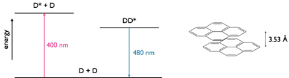
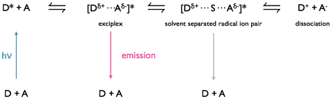
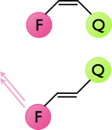

# Other Excited State Systems {#ch:excited}

### Learning Objectives {#sec:exitedLOs}


At the end of this section you should be able to:

- Explain the origin of excimer and exciplex emission spectra.
- Describe why excimer and exciplex formation are concentration dependent.
- Interpret changes in emission spectra with changing concentration to justify formation of either excimers or exciplexes.
- Show an awareness of excited state reactions and rearrangements.


## Excimers {#sec:excimers}

An excimer is an excited state dimer formed between two identical molecules. A photon is delocalised between two molecules which in the excited state are weakly bound together. Excimers are relatively long lived species, and were first noticed when increasing the concentration of certain fluorophores. 

It was found that upon increasing the concentration of the chromophore the fluorescence did not increase linearly, and upon reaching higher concentrations the fluorescence decreased; however, this decrease in fluorescence occurred with an increase in a new emission band of lower energy. Excimer bands tend to be broad featureless and Gaussian in profile, figure 33. It is important to note that there is no bonding between the chromophores in the ground state; excimers only occur at high concentrations as an excited state molecule has to interact with a second ground state molecule in the lifetime of the excited state. There is no change in the absorption of the sample (as there is only excitation of monomer species), only formation of a new band in the emission spectrum.

Excimers exist because of formation of a weak bond between the two chromophores as shown in figure \@ref(fig:excimer). By formation of this bond any emission from the excimer has to be lower in energy than the fluorescence of the monomer chromophore. The ground state consists of two molecules in an dissociated state, upon emission from the excimer the structure of the excimer remains (as with the Stokes shift) and the two molecules diffuse apart.

It is important to note that there is no charge separation in the excimer and that the excited state is shared across both molecules.

```{r echo=FALSE, excimer, out.width='70%', fig.show='hold', fig.align='center', fig.cap='The monomer and excimer emission of pyrene, and an energy level profile showing the fluorescence from the non-bonded D* state as well as the excimer emission from the DD* state.'}
knitr::include_graphics("images/excimer.png")
```

```{r echo=FALSE, pyreneexcimer, out.width='70%', fig.show='hold', fig.align='center', fig.cap='A pyrene excimer with a separation of 3.53 Å between the two planes of nuclei, in the excited state dimer the two ring systems of pyrene have a weak interaction between them. The emission maxima of fluorescence is 400 nm whereas the emission maxima for the excimer is 480 nm.'}

```

A concept bite video briefly covering the concepts of eximers and exciplexes (video length 7m05s)

<div style="text-align: center;"><iframe width="480" height="360" src="https://www.youtube.com/embed/EOURuV9cNOM" frameborder="0" allow="accelerometer; autoplay; encrypted-media; gyroscope; picture-in-picture" allowfullscreen></iframe></div>

## Exciplexes

Excimers consist of an excited state shared between two identical monomer units, whereas exciplexes are excited state complexes of two different chromophores. Due to the differences in molecular orbitals of the chromophores exciplexes have a dipole across the excited state complex; this dipole can lead to formation of a charge separated species, figure \@ref(fig:exciplex).

Exciplexes can undergo emission from this state, leading to formation of dissociated monomer units or there can be a solvent reorganisation leading to formation of a solvent separated radical ion pair, at this point there can still be charge recombination and relaxation of the system (this time with the excess energy lost as heat) to the original monomer chromophore units.

```{r echo=FALSE, exciplex, out.width='70%', fig.show='hold', fig.align='center', fig.cap='Formation of an exciplex from an excited state donor and ground state acceptor chromophore. The exciplex has a small charge separation leading to a dipole over the excited state complex, under some circumstances with the introduction of solvent between the chromophores in the exciplex this can then go on to form a solvent separated radical ion pair which may then go on to form a charge separated redox pair.'}

```

```{r echo=FALSE, exciplexenergy, out.width='70%', fig.show='hold', fig.align='center', fig.cap='Energy profile of exciplex formation showing the lower energy state of the exciplex over the D* + A system. Emission from the exciplex is lower energy than fluorescence from the monomer donor chromophore.'}
knitr::include_graphics("images/exciplexenergy.png")
```

Exciplexes are common in organic solvent as non polar solvents are not good at stabilising ions in solution, as the polarity of the solvent increases then the charge separated state becomes more favoured. Exciplexes and other charge separated species are of interest in chemistry for use in molecular wires and energy storage devices.

Please see video above in Section \@ref(sec:excimers) for a review of this topic (timecode 4m52s).

## Photoinduced Isomerisation {#sec:photoinducedisom}

When discussing the absorption of light it was noted that by promotion of an electron into an anti-bonding orbital the bond order was reduced. In the case of double (π) bonds in molecules such as retinal (figure), the bond order of one of the double bonds is reduced and therefore allows rotation around this now single bond, as the energy is lost (either by internal conversion or emission) the π-bond is restored. A simple Lewis model of bonding is convenient, however we have to consider the molecular orbital, and this version of bonding highlights a particular bond which is weakened in the excited state, consequently rotation occurs around a specific bond in a conjugated chain.

```{r echo=FALSE, retinal, out.width='70%', fig.show='hold', fig.align='center', fig.cap='The cis-trans isomerisation of retinal, which when combined with the protein rhodopsin is vital in vision. Absorption of a photon, reduces the bond order of a specific bond due to characteristics of the excited state molecular orbital.'}
knitr::include_graphics("images/retinal.png")
```


The steady state photochemical yield of any such cis-trans isomerisation will depend upon the absorption of each of the chromophore isomers at the excitation wavelength, the composition of this  steady state is referred to as the photostationary state. The composition of this photostationary state may be easily calculated making only minor assumptions.

The most important of these assumptions is that when in the excited state there is an equal probability that the molecule will relax to the cis & trans states. The second assumption is that (near) monochromatic light is used, because we have already seen that the molar extinction coefficient is very wavelength dependent. Finally the excitation has to occur long enough for the (steady state) photostationary state to be established.


Figure \@ref(fig:cistransstilbene) shows the absorption spectra of the two isomers of stilbene, there are a number of interesting photophysical details about this molecule, but it should be noted that the molar extinction coefficient is different for each of the isomers. The point where the two spectra cross is called the isobestic point , for stilbene this is 288 nm, if the system is excited at this wavelength then the yield of each isomer will be the same. However at all other wavelengths the yield of one isomer will be higher than the other. If an excitation wavelength is used whereby the molar extinction coefficient of the trans isomer is highest then this isomer is excited preferentially and there is less of this isomer is the photostationary state.

```{r echo=FALSE, cistransstilbene, out.width='60%', fig.show='hold', fig.align='center', fig.cap='The absorption spectra of trans \\& cis stilbene in hexane.'}
knitr::include_graphics("images/cistransstilbene.png")
```

In summary the higher the molar absorption coefficient at the excitation wavelength the lower the yield of that product in the photostationary state.

The dynamics of cis-trans isomerisation may be studies by using some of the photophysics already discussed. Figure \@ref(fig:cisquench) shows a cis / trans system, in the cis position the emission from a fluorophore is quenched so there is no visible emission from the dye. In the trans position position of the quencher now means that there is either no quenching or the quenching is greatly reduced, consequently the emission from the fluorophore is greatly increased. 

```{r echo=FALSE, cisquench, out.width='20%', fig.show='hold', fig.align='center', fig.cap='The quenching of emission of a fluorophore by a nearby quencher, in the cis configuration the emission from the fluorophore is completely quenched, whereas in the trans configuration emission from the fluorophore is observed.'}

```


## Before Completing this Section
To support the material in this section it is suggested you read pages 90-96 of Wardle ‘Principles and Application of Photochemistry’.

