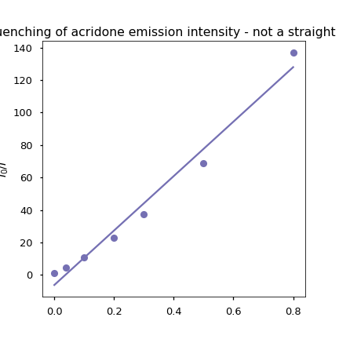

# Workshop Questions for Week 5 {#ch:Workshop4}

## Questions

### Short mathematical question - Determining rates of diffusion controlled quenching {#sec:diffcontrol}

The rate of diffusion ($k_d$) in solution is given by equation \@ref(eq:diffcontrolrate), where $\eta$ is the viscosity of the solution. 

\begin{equation}
k_d = \frac{8RT}{3 \eta}
(\#eq:diffcontrolrate)
\end{equation}

Determine the maximum possible rate of diffusion controlled quenching at 20 ºC in:

a. water ($\eta=$ 1.0016 mPa s)
a. methanol ($\eta=$ 0.594 mPa s)

*(I will use UniDoodle to ask this in class)*

### Short mathematical question - Determining the effect of diffusion controlled quenching on emission intensity {#sec:emintquench}

What emisison intensity would you expect if 50 mM of a quencher quenches the emission of a chromophore dissolved in basic ethanol at 10 ºC, with natural lifetime of 13.2 ns and emission quantum yield, Φ~f~, of 0.32, if the unqunched intensity is 35240.

$\eta$~EtOH, 10 ºC~ = 1.394 mPa s

*(This will be a discussion question)*

### Short conceptual question - effect of temperature {#sec:temp}

YO-Pro-1 is quenched in the presence of molecular oxygen, as the temperature increases this quenching increases, what does this indicate about the mechanism of quenchign and why?

*(This will be a discussion question)*

### Short conceptual question - change in behaviour on freezing

As the concentration of a species increases the wavelength of emission increases in the solution phase but this same shift in wavelength is not when the solution is frozen. What photochemical process may be occuring to explain this effect?

*(This will be a discussion question)*

### Short conceptual question - static quenching {#sec:static_question}

When in the presence of a quencher the intensity of emission of a chromophore (τ~0~ = 5.2 ns) was reduced from 4200 cps to 2100 cps at 25 ºC and 1800 cps at 10 ºC. What would the lifetime of the quenched chromophore be at 25 ºC?

*(This will be a discussion question)*

### Short conceptual question - isoemissive point  

As the concentration of pyrene dissolved in toluene increases a new broad band with a broad featureless spectrum is observed, which is from excimer emisison. What evidence is there that emission is only from single molecule and excimer emission and no other states?

How would the absorption spectrum change as the concentration increases?

```{r echo=FALSE, pyrene, out.width='30%', fig.show='hold', fig.align='center', fig.cap='The emission spectrum of pyrene in tolune as low (solid line) and higher (dotted lines) concentrations.'}

```


### Short conceptual question - static quenching {#sec:static2}

10-methylacridinium chloride (MAC) is quenced in the presence of adenosine monophosphate (AMP, figure (\@ref(fig:AMP))). The effect of quenching is enhanced by addition of sodium sulfate.

In a separate experiment the emssion of MAC is unaffected by addition of  sodium sulfate (when not in the presence of AMP).

Suggest the mechanism of quenching, justifying this with reference to the experimental data.

```{r echo=FALSE, MAC, out.width='30%', fig.show='hold', fig.align='center', fig.cap='The structure of methyl acridinium.'}
knitr::include_graphics("images/MAC.png")
```

```{r echo=FALSE, AMP, out.width='30%', fig.show='hold', fig.align='center', fig.cap='The structure of adenosine monophosphate.'}
knitr::include_graphics("images/AMP.png")
```

*(This will be a discussion question)*

### Long mathematical question - Quenching of emission of acridone {#sec:acridone}

Acridone (figure \@ref(fig:acridone))is found to be quenched in the presence of potassium iodide in aqueous solution at 26 oC. Solutions were maintained at constant ionic strength by use of KNO2, the KNO2 does not affect the emission intensity of the solution.

```{r echo=FALSE, acridone, out.width='30%', fig.show='hold', fig.align='center', fig.cap='The structure of acridone.'}
knitr::include_graphics("images/acridone.png")
```

The following data were collected for the emission of acridone.

Table: (\#tab:acridonequench) The effect of potassium iodide concentration on emission intensity and fluorescence lifetime of acridone in aqueous solution.

| [KI] / M | [KNO~2~] / M | Emission intensity / arb | τ / ns |
|:--------:|:--------:|:--------:|:--------:|
| 0 | 1.100 | 16580 | 17.60 |
| 0.040 | 1.060 | 3753 | 3.90 |
| 0.100 | 1.000 | 1566 | 1.80 |
| 0.200 | 0.900 | 721 | 0.95 |
| 0.300 | 0.800 | 446 | 0.64 |
| 0.500 | 0.600 | 242 | 0.39 |
| 0.800 | 0.300 | 121 | 0.25 |

1. Using an appropriate plot (or plots) determine if the quenching is static, dynamic or a combination of both mechanisms. 

1. Determine any relevant quenching constants (k~d~ and/or K~S~ )

*(This will be a discussion question)*

## Answers

### Short mathematical question - Determining rates of diffusion controlled quenching {#sec:diffcontrolans}

\begin{equation}
k_d = \frac{8RT}{3 \eta}
(\#eq:diffcontrolrate)
\end{equation}

Nominally this is simple but it needs some careful unit conversion, in water:

\begin{equation*}
k_d = \frac{8 \times 8.31447 \textrm { J K$^{-1}$ mol$^{-1}$} \times 293 \textrm{ K}}{3 \times 1.0016 \times 10^{-3} \textrm{ Pa s}}
\end{equation*}

\begin{equation*}
k_d = \frac{8 \times 8.31447 \textrm { kg m$^2$ s$^{-2}$ K$^{-1}$ mol$^{-1}$} \times 293 \textrm{ K}}{3 \times 1.0016 \times 10^{-3} \textrm{ kg m$^{-1}$ s$^{-2}$ s}}
\end{equation*}

$k_d= 6.49 \times 10^6$ mol$^{-1}$  m$^3$ s$^{-1}$

$k_d= 6.49 \times 10^9$  mol$^{-1}$  dm$^3$ s$^{-1}$

in methanol $k_d= 1.09 \times 10^{10}$  mol$^{-1}$  dm$^3$ s$^{-1}$

### Short mathematical question - Determining the effect of diffusion controlled quenching on emission intensity {#sec:emintquenchans}

Combining equations  \@ref(eq:QYfluor) and \@ref(eq:lifetimefluor), we get equation \@ref(eq:natural), see Section \@ref(sec:YieldLifetime).

This means we can rearrange to give:

\begin{equation*}
\tau = \tau^0 \phi_f = 13.2 \textrm{ ns} \times 0.32
\end{equation*}

$\tau_{unquenched}$ = 4.2 ns (note this will be refered to as $\tau_0$ from this point on).

From equation \@ref(eq:diffcontrolrate) in section \@ref(sec:diffcontrol) we can determine $k_d = 4.50 \times 10^9$ mol$^{-1}$  dm$^3$ s$^{-1}$.

The Stern-Volmer equation \@ref(eq:sternvolmer) shows how the concentration of a quencher affects the intensity, lifetime or quantum yield:

\begin{equation}
\frac{\tau_0}{\tau}=\frac{\phi_0}{\phi}=\frac{I_0}{I}=1+ k_q \tau_0
(\#eq:sternvolmer)
\end{equation}

Rearranging

\begin{equation*}
I = \frac{I_0}{1 + k_q \tau_0 [Q]}= \frac{3520}{1+0.945}
\end{equation*}

I = 18k

### Short conceptual question - effect of temperature {#sec:tempans}

This would indicate dynamic quenching, the rate of diffusion control is proporitional to temperature, equation \@ref(eq:diffcontrolrate) in section \@ref(sec:diffcontrol), the higher the rate the more collisional deactivation. A static quenching is an equilibrium complex and the weak intermolecular bonding is broken as temperature increases and so static quenching decreases with increasing temperature.

```{r echo=FALSE, quenchingtemp, out.width='100%', fig.show='hold', fig.align='center', fig.cap='The effect of temperature on dynamic (right) and static (left) quenching.'}
knitr::include_graphics("images/quenchintensityconc.png")
```


### Short conceptual question - static quenching {#sec:staticans}

Ok - more than a hint in the question title, but why?

Here as the temperature is decreased the amount of quenching increases, this indicates formation of a non-emissive static complex held togehter by a weak intermoleular bond. (Figure \@ref(fig:quenchingtemp)).


```{r echo=FALSE, staticquench, out.width='100%', fig.show='hold', fig.align='center', fig.cap='The effect of temperature on dynamic (right) and static (left) quenching.'}
knitr::include_graphics("images/staticquenching.png")
```

Since the fluorophore now exists in one of two states (the unquenched free choromophore and the non-emissive bound chromophore) any fluorescence observed is unquenched and so the measured lifetime remains the same. 


### Short conceptual question - static quenching {#sec:static2ans}

Again I give away the mechanism in the question title, but why is it static?

The principle reason is the sodium sulfate, it is clearly not quenching as there is no effect when it is added to the MAC solution, and there is no reason it should affect the rate of diffusion when combined with AMP.

Therefore we are left to conclude it is static quenching, but what is the role of the sulfate. This goes back to the non-ideality of ionic solutions, and the addition of a salt is almost certainly providing an ionic atmosphere that is helping to move the equilibrium to the complex, by making this state more stable.

Having a constant ionic strength is vitally important in experiments (not just electrochemistry), and the role of the KNO~2~ in Question \@ref(sec:acridone) is just there to ensure the ionic strength of the system remains constant.

### Long mathematical question - Quenching of emission of acridone {#sec:acridoneans}

```{r echo=FALSE, acridoneI0I, out.width='70%', fig.show='hold', fig.align='center', fig.cap='The ratio of emisison intensity  relative to the unquenched intensity plotted as a function of temperature with a (clearly bad) linear fit.'}

```

Since the plot of $\frac{I_0}{I}$ vs [Q] is non linear this would likely indicate that quenching is a combination of both static and dynamic quenching.

\begin{equation*}
\frac{I_0}{I}=(1 + K_s [Q])(1 + k_q \tau _0 [Q])
\end{equation*}

Given we have lifetime data we can easily determine the dynamic rate constant by plotting $\frac{\tau_0}{\tau}$ vs [Q] (Equation \@ref(eq:sternvolmer)).

```{r echo=FALSE, acridonequench, out.width='70%', fig.show='hold', fig.align='center', fig.cap='The graph allows determination of both quenching constants'}
knitr::include_graphics("images/acridonequench.png")
```

From this K~S~ = 1.19 and k~q~ = 4.94 × 10^9^ M^-1^ s^-1^

I solved this in python and the notebook is available on request.
