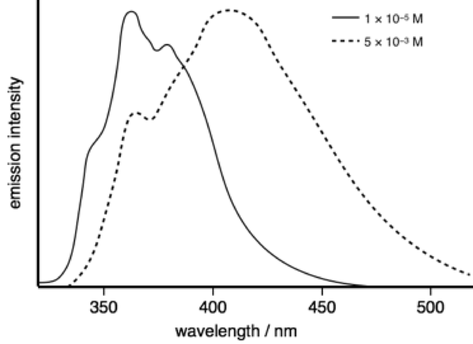

# Workshop Questions for Week 6 {#ch:Workshop5}

## Short conceptual question - O2 quenching {#sec:O2quench_question}

1. Given molecular oxygen has an emission with λ~max~ around 1280 nm why is it such a good quencher of excited states?

1. Why is the efficiency of quenching lower for excited singlet states?

*Are you all happy with the energy level diagram of molecular oxygen?*

*(This will be a discussion question)*

## Short mathematical question - Förster resonance energy transfer {#sec:FRET}

A donor, D, with an unquenched lifetime of 5.0 ns, was found to have a steady state emission intensity of 20.5 in free solution and 4.1 when in the presence of a quencher, Q. Assuming the Förster distance is 50 Å determine :

1. the transfer efficiency, E.
1. the lifetime of D in the presence of the quencher Q
1. the equilibrium separation of D & Q
1. the rate constant for energy transfer

*(This will be a discussion question)*

## Short conceptual quesiton - Förster distance {#sec:FRETdist}

Determine the quantum yield of emission of the donor in a FRET pair system where donor and acceptor are separated by the Förster distance, the lifetime of the unquenched system is 8.4 ns. The unquenched quantum yield is 0.58*


*(I will poll this question on UniDoodle and then maybe discuss some of the responses)*

## Short conceptual question - redox chemistry

Why does formation of an excited state decrease both the oxidation and reduction potential of a species?

## Short conceptual quesiton - Donor-accceptor system {#sec:donoracceptor}

In a single molecule study of a donor bound to an acceptor via a flexible, short aliphatic chain it was found that lifetime of the excited state varied (time beween single photon detection of emission after an excitation pulse). Suggest why this is the case.

*(This will be a discussion question)*

## Short conceptual quesiton - Quenching of ruthenium {#sec:ruquench}

Ruthenium tris bipyridine [Ru(bpy)~3~]^2+^ has a  λ~max, abs~ = 470 nm and λ~max, em~ = 465 nm. The natural lifetime is 13.6 µs.

Suggest why molecular oxygen is an efficient quencher of the emmission of [Ru(bpy)~3~]^2+^.

*(This will be a discussion question)*

## Short conceptual question - Energy transfer and spectra {#sec:spectra}

How would you expect the absorption and emission spectra observed in an experiment to change when an emmisive acceptor is added?

If you keep the emisison wavelength the same and scan the intensity of this band with changing excitation wavelength how will this (excitation) spectrum vary from the absorbance and how can it be used to confirm energy transfer?

*(This will be a discussion question)*

## Short conceptual question - Effect of separation {#sec:FRETDNA}

A 'cyanine-3' and 'cyanine-5' are cyanine dyes which are frequently used as markers in experiments with DNA. 

Cyanine-3 has a λ~max, abs~ = 554 nm and λ~max, em~ = 568 nm

Cyanine-5 has a λ~max, abs~ = 649 nm and λ~max, em~ = 666 nm

In an experiment they are tethered to either end of a DNA oligomer of 4, 5, 6, 7, 8, 9, 10 11 & 12 base pairs. However the pattern expected of increasing lifetime as the separation increased was not observed. Suggest why this may be occuring.

*(This will be a discussion question)*

## Short conceptual question - lifetimes

The emission spectra of 2-phenylindole shows a marked difference with changes in concentration. 

At a concentration of 1 × 10^−5^ M the measured lifetime is 0.86 ns, whereas at 5 × 10^−3^ M the measured lifetime is 3.42 ns.


```{r echo=FALSE, phenylindole, out.width='30%', fig.show='hold', fig.align='center', fig.cap='The emission spectrum of pyrene in tolune as low (solid line) and higher (dotted lines) concentrations.'}

```

Why does the measured lifetime depend upon concentration?

*(This will be a discussion question)*

## Short conceptual question - effect of time delay

If a solution of pyrene in cyclohexane is excited with a very short (ps) pulse of lightafter 1 ns the emission spectrum observed is mainly that of the momomer, whereas after 100 ns emission is principally from the excimer. Why is this the case?

*(This will be a discussion question)*


### Short conceptual question - effect of polar solvents on emission {#sec:polarsolv}

Solutions containing anthracence and diethylaniline are shown to have broad emission at around 450 nm in toluene, but in dichloromethane no emission is observed.

The emission from athracene has λ~max~ of 375 nm.

Suggest the processes going on which account for these observations.

You can find the answer to this question in \@ref(sec:polarsolvans)
