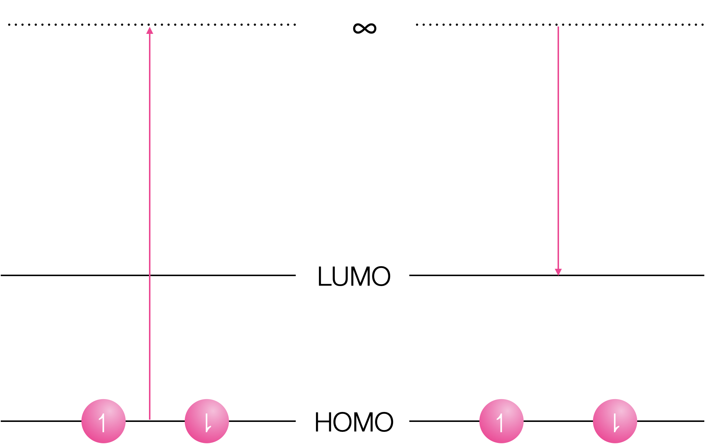
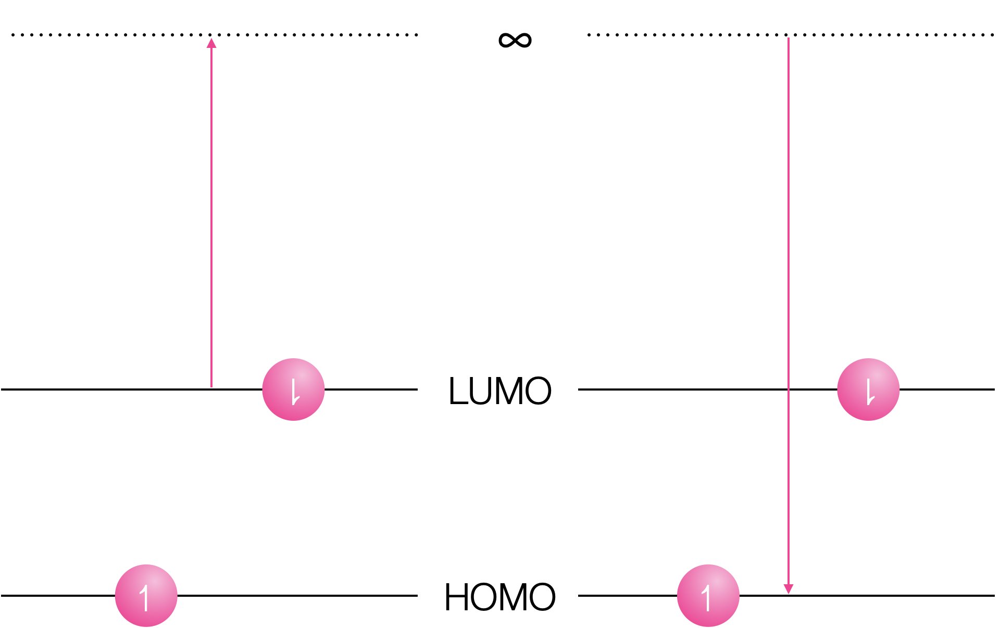

# Workshop Questions for Week 6 {#ch:Workshop5}

## Questions

### Short conceptual question - O2 quenching {#sec:O2quench_question}

1. Given molecular oxygen has an emission with λ~max~ around 1280 nm why is it such a good quencher of excited states?

1. Why is the efficiency of quenching lower for excited singlet states?

*Are you all happy with the energy level diagram of molecular oxygen?*

*(This will be a discussion question)*

### Short mathematical question - Förster resonance energy transfer {#sec:FRET}

A donor, D, with an unquenched lifetime of 5.0 ns, was found to have a steady state emission intensity of 20.5 in free solution and 4.1 when in the presence of a quencher, Q. Assuming the Förster distance is 50 Å determine :

1. the transfer efficiency, E.
1. the lifetime of D in the presence of the quencher Q
1. the equilibrium separation of D & Q
1. the rate constant for energy transfer

*(This will be a discussion question)*

### Short conceptual quesiton - Förster distance {#sec:FRETdist}

Determine the quantum yield of emission of the donor in a FRET pair system where donor and acceptor are separated by the Förster distance, the lifetime of the unquenched system is 8.4 ns. The unquenched quantum yield is 0.58*


*(I will poll this question on UniDoodle and then maybe discuss some of the responses)*

### Short conceptual question - redox chemistry

Why does formation of an excited state decrease both the oxidation and reduction potential of a species?

### Short conceptual quesiton - Donor-accceptor system {#sec:donoracceptor}

In a single molecule study of a donor bound to an acceptor via a flexible, short aliphatic chain it was found that lifetime of the excited state varied (time beween single photon detection of emission after an excitation pulse). Suggest why this is the case.

*(This will be a discussion question)*

### Short conceptual quesiton - Quenching of ruthenium {#sec:ruquench}

Ruthenium tris bipyridine [Ru(bpy)~3~]^2+^ has a  λ~max, abs~ = 470 nm and λ~max, em~ = 465 nm. The natural lifetime is 13.6 µs.

Suggest why molecular oxygen is an efficient quencher of the emmission of [Ru(bpy)~3~]^2+^.

*(This will be a discussion question)*

### Short conceptual question - Energy transfer and spectra {#sec:spectra}

How would you expect the absorption and emission spectra observed in an experiment to change when an emmisive acceptor is added?

If you keep the emisison wavelength the same and scan the intensity of this band with changing excitation wavelength how will this (excitation) spectrum vary from the absorbance and how can it be used to confirm energy transfer?

*(This will be a discussion question)*

### Short conceptual question - Effect of separation {#sec:FRETDNA}

A 'cyanine-3' and 'cyanine-5' are cyanine dyes which are frequently used as markers in experiments with DNA. 

Cyanine-3 has a λ~max, abs~ = 554 nm and λ~max, em~ = 568 nm

Cyanine-5 has a λ~max, abs~ = 649 nm and λ~max, em~ = 666 nm

In an experiment they are tethered to either end of a DNA oligomer of 4, 5, 6, 7, 8, 9, 10 11 & 12 base pairs. However the pattern expected of increasing lifetime as the separation increased was not observed. Suggest why this may be occuring.

*(This will be a discussion question)*

### Short conceptual question - lifetimes

The emission spectra of 2-phenylindole shows a marked difference with changes in concentration. 

At a concentration of 1 × 10^−5^ M the measured lifetime is 0.86 ns, whereas at 5 × 10^−3^ M the measured lifetime is 3.42 ns.


```{r echo=FALSE, phenylindole, out.width='30%', fig.show='hold', fig.align='center', fig.cap='The emission spectrum of pyrene in tolune as low (solid line) and higher (dotted lines) concentrations.'}
knitr::include_graphics("images/phenylindole.png")
```

Why does the measured lifetime depend upon concentration?

*(This will be a discussion question)*

### Short conceptual question - effect of time delay

If a solution of pyrene in cyclohexane is excited with a very short (ps) pulse of light after 1 ns the emission spectrum observed is mainly that of the momomer, whereas after 100 ns emission is principally from the excimer. Why is this the case?

*(This will be a discussion question)*


### Short conceptual question - effect of polar solvents on emission {#sec:polarsolv}

Solutions containing anthracence and diethylaniline are shown to have broad emission at around 450 nm in toluene, but in dichloromethane no emission is observed.

The emission from athracene has λ~max~ of 375 nm.

Suggest the processes going on which account for these observations.

You can find the answer to this question in \@ref(sec:polarsolvans)

## Answers

### Short conceptual question - change in behaviour on freezing

This will be due to excimer emission. An excimer relies on diffusion for an excited state chromophore to migrate to meet a ground state chromophore and form the excimer, if no diffusion can occur no excimers can form.

This is supported by the increase in emission wavelength for the solution phase, excimer emission is always at lower energy (longer wavelength) than the corresponding monomer emission.

### Short conceptual question - effect of polar solvents on emission

The principle difference betewen these two solvents is polarity, therefore the polarity of the solvent is affecting the ability of a species to emit. Also there are two species in solution.

Consquently, emission is likely from an exciplex, which is non-emissive in the polar solvent as a stable radical ion pair is formed instead.

### Short conceptual question - isoemissive point  

The  broad Gaussian emission only occurs at higher concentrations, between the featureless broad shape and its concentration depenedence this supports excimer emission, as does only a single species in solution. The presence of an isoemissive point (where the lines all cross) indicated that there are just 2 species in solution (this cannot exist with 3 or more species).

Since only monomers exist in the ground state the absorption spectrum shouldn't change.

Just as a note you see isobestic points (points where absorbance spectra cross) where you have a mixture of just two species - this could be a sign to indicate binding to a singel site and free dye.

### Short conceptual question - redox chemistry

Both oxidation and reduction become more favorable in the exited state.

```{r echo=FALSE, gsredox, out.width='70%', fig.show='hold', fig.align='center', fig.cap='Oxidation of the ground state requires removal of an electron in the HOMO to infinity, and reduction inserts the electron into the empty LUMO.'}

```

```{r echo=FALSE, excitedredox, out.width='70%', fig.show='hold', fig.align='center', fig.cap='Oxidation of the excited state removes the electron from the LUMO and reduction inserts the electron into the vacant hole in the HOMO.'}

```

### Short conceptual question - effect of time delay


Excimers have to diffuse to form, therefore very shortly after the pulse it is unsurprising that any emission which does occur is principlaly from the monomer, after100 ns the chromophore will have had more time to diffuse and form excimers (see your second year notes on Fick's laws for diffusion).

### Short conceptual question - lifetimes


The higher concentration spectrum shows a classic Gaussian (broad and featureless) emission this occurs at high concentration due to limits on diffusion allowing an excited state to meet a ground state, indicating an excimer (only single species in solution). There is no reason why the emission lifetime of the monomer and the emission lifetime of the excimer should be the same. So combinging new peak likely from excimer emission it would indicate the shorter lifetime is monomer emission with the longer (still ns) lifetime being emission from the excimer.


### Short conceptual question - effect of time delay


Diffusion takes time. At very short time delays there is unlikely to have been time for an excited state monomer to diffuse and form an excimer and so any emission that occurs is from the momomer. At longer time periods diffusion to form the excimer has had a chance to occur and so emission from the excimer is observed.


### Short conceptual question - effect of polar solvents on emission {#sec:polarsolv}

You can find the answer to this question in \@ref(sec:polarsolvans), but since we have two components and the emission is described as broad then we have an exciplex emission. Given that the emission is only observed in the non-polar solvent then what we are observing in the polar solvent is the non-emissive charge transfer complex.
